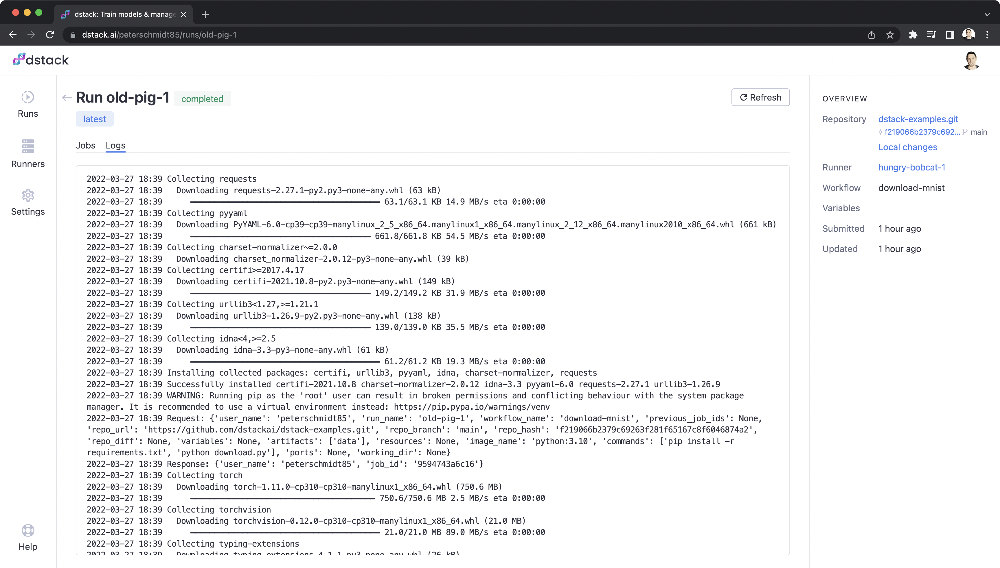

# dstack: Automate data & training workflows effortlessly 

An open platform to automate data and training workflows, provision infrastructure, and version data and models.



## Key features

* **Declarative workflows**: Define workflows and infrastructure requirements as code using declarative configuration
  files.
* **Infrastructure on-demand**: When you run a workflow, dstack provisions the required infrastructure
  on-demand.
  You can either provision infrastructure on-demand in your existing cloud account (e.g. AWS, GCP,
  Azure, etc.) or use your existing hardware.
* **Versioning artifacts**: Version data and models produced by workflows automatically. Assign tags to successful runs to refer to their
  artifacts from other workflows.
* **Providers marketplace**: Use the built-in workflow providers (that support specific use-cases), or create custom providers for specific
  use-cases using dstack's Python API.

## Getting started

### Step 1: Set up runners

Runners are machines that run submitted workflows. dstack supports two types of runners: "on-demand"
and "self-hosted". 

#### Option 1: Set up on-demand runners

To use on-demand runners, go to the settings, then `AWS`.

Here, you have to provide `AWS Access Key ID` and `AWS Secret Access Key` that have the
corresponding permissions to create EC2 instances in your `AWS` account.

Once you've specified credentials, click the `Add limit` button to configure limits:


The configured limits represent the maximum number of EC2 instances of the specific `Instance Type` and in the specific `Region`, that
dstack can create at one time to run workflows.

#### Option 2: Set up self-hosted runners

As an alternative to on-demand runners, you can run workflows on your own hardware. 

To do that, you have to run the following command on your server:

```bash
curl -fsSL https://get.dstack.ai/runner -o get-dstack-runner.sh
sudo sh get-dstack-runner.sh
dstack-runner config --token <token>
dstack-runner start
```

Your `token` value can be found in settings:


If you've done this step properly, you'll see your server on the runners page:


### Step 2: Install the CLI

Now, to be able to run workflows, install and configure the dstack CLI:

```bash
pip install dstack -U
dstack config --token <token> 
```

### Step 3: Clone the repo

Just to get started, we'll run workflows defined in 
[`github.com/dstackai/dstack-examples`](https://github.com/dstackai/dstack-examples).

```bash
git clone https://github.com/dstackai/dstack-examples.git
cd dstack-examples
```

The project includes two workflows: `download-mnist` and `train-mnist`. The frst workflow downloads the [MNIST](http://yann.lecun.com/exdb/mnist/) dataset,
whilst the second workflow trains a model using the output of the first workflow as an input:

`.dstack/workflows.yaml`:

```yaml
workflows:
  - name: download-mnist
    provider: python
    requirements: requirements.txt
    python_script: download.py
    artifacts:
      - data

  - name: train-mnist
    provider: python
    requirements: requirements.txt
    python_script: train.py
    artifacts:
      - model
    depends-on:
      - download-mnist
    resources:
      gpu: ${{ gpu }}     
```

`.dstack/variables.yaml`:

```yaml
variables:
 train-mnist:
   gpu: 1
   batch-size: 64
   test-batch-size: 1000
   epochs: 1
   lr: 1.0
   gamma: 0.7
   seed: 1
   log-interval: 10
```

### Step 4: Run workflows

Go ahead, and run the `train-mnist` workflow using the following command:

```bash
dstack run train-mnist 
```

If you want to change any of the variables, you can do that in `.dstack/variables.yaml`, or from the CLI:

```bash
dstack run train-mnist --gpu 2 --epoch 100 --seed 2
```

When you run `train-mnist`, because `train-mnist` depends on `download-mnist`, dstack will create a run with two jobs: 
one for `train-mnist` and one for `download-mnist`:


### Step 5: Tag runs

When the `Run` is finished, you can assign a tag to it, e.g. `latest`:

```bash
dstack tag cowardly-goose-1 latest
```

Now, you can refer to this tagged workflow from `.dstack/workflows.yaml`:

```yaml
   workflows:
     - name: download-mnist
       provider: python
       requirements: requirements.txt
       python_script: download.py
       artifacts:
         - data

     - name: train-mnist
       provider: python
       requirements: requirements.txt
       python_script: train.py
       artifacts:
         - model
       depends-on:
         - download-mnist:latest
       resources:
         gpu: 1     
```

Now, if you run the `train-mnist` workflow, dstack won't create a job for the `download-mnist` workflow.
Instead, it will reuse the artifacts of the tagged workflow.

## Repository

This repository contains dstack's open-source and public code, documentation, and other key resources:

* [`providers`](providers): The source code of the built-in dstack workflow providers
* [`cli`](cli): The source code of the dstack CLI pip package
* [`docs`](docs): A user guide to the whole dstack platform ([docs.dstack.ai](https://docs.dstack.ai))

Here's the list of other packages that are expected to be included into this repository with their source code soon:

* `runner`: The source code of the program that runs dstack workflows
* `server`: The source code of the program that orchestrates dstack runs and jobs and provides a user interface
* `examples`: The source code of the examples of using dstack

## Contributing

Please check [CONTRIBUTING.md](CONTRIBUTING.md) if you'd like to get involved in the development of dstack.

## License

Please see [LICENSE.md](LICENSE.md) for more information about the terms under which the various parts of this repository are made available.

## Contact

Find us on Twitter at [@dstackai](https://twitter.com/dstackai), join our [Slack community](https://join.slack.com/t/dstackai/shared_invite/zt-xdnsytie-D4qU9BvJP8vkbkHXdi6clQ) for quick help and support.

Project permalink: `https://github.com/dstackai/dstack`