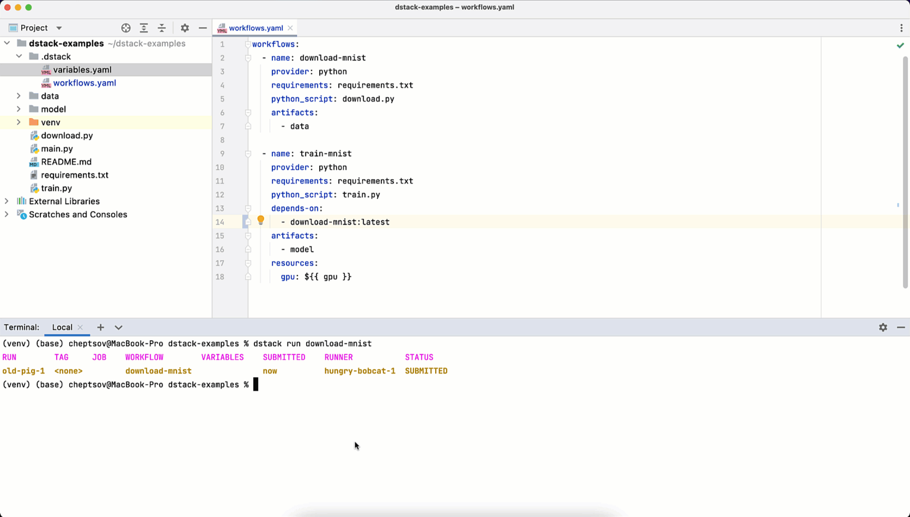

# 🧬dstack

dstack is the modern CI/CD made for training models

## Key features

* **Automate training workflows**: Define workflows and infrastructure requirements as code using declarative configuration
  files. 
* **Use a cloud vendor of your choice**: Provision infrastructure on-demand in your existing cloud account (e.g. AWS, GCP,
  Azure, etc.) or use your existing hardware.
* **Version and reuse artifacts**: Version data and models produced by workflows automatically. Assign tags to successful runs to refer to their
  artifacts from other workflows.
* **Providers marketplace**: Use the built-in workflow providers (that support specific use-cases), or create custom providers for specific
  use-cases using dstack's SDK.



## How dstack works

Workflows are defined in the `.dstack/workflows.yaml` file within your project. Here's an example:

```yaml
workflows:
  # This workflow loads and prepares data 
  - name: prepare
    # This workflow uses `python` provider
    provider: python
    script: prepare.py
    # The `data` folder will be saved in real-time as an output artifact
    artifacts:
      - data

  # This workflow trains a model using the data from the `prepare` workflow
  - name: train
    # This workflow uses `python` provider
    provider: python
    script: train.py
    # The `checkpoint` folder will be saved in real-time as an output artifact
    artifacts:
      - checkpoint
    # This workflow depends on the output artifacts of the `prepare` workflow with the tag `latest`
    depends-on:
      - prepare:latest
    # Here we define what resources our workflow needs to run. 
    resources:
      memory: 64GB
      # You can parametrize any property of a workflow using variables 
      gpu: ${{ gpu }}    
```

Workflows can be run via the CLI:

```bash
dstack run train --gpu 2 --epoch 100 --seed 2
```

Once you run a workflow, dstack will build a graph of dependencies, and trigger the corresponding providers 
to create actual jobs. Once jobs are created, dstack will provision the required infrastructure (either
in your own cloud account, or in your own hardware if any).

You can either use the built-in providers, the providers built by the community, or
create [custom providers](https://docs.dstack.ai/custom-providers)
for custom use-cases using the dstack AI.

As jobs are running, dstack tracks the output logs and artifacts in realtime.

Finally, once a run is successful, you can assign a tag to it and reuse it from other workflows.

## Get started

The easiest way to install dstack on-premise is by using its public Docker
image: [`dstackai/dstack`](https://hub.docker.com/r/dstackai/dstack)

**[Sign up for early access to the in-cloud-version](https://tally.so/r/n9zzGm)**

## Repository

This repository contains dstack's open-source and public code, documentation, and other key resources:

* [`providers`](providers): The source code of the built-in dstack workflow providers
* [`cli`](cli): The source code of the dstack CLI pip package
* [`docs`](docs): A user guide to the whole dstack platform ([docs.dstack.ai](https://docs.dstack.ai))

Here's the list of other packages that are expected to be included into this repository with their source code soon:

* `runner`: The source code of the program that runs dstack workflows
* `server`: The source code of the program that orchestrates dstack runs and jobs and provides a user interface
* `examples`: The source code of the examples of using dstack

## Contributing

Please check [CONTRIBUTING.md](CONTRIBUTING.md) if you'd like to get involved in the development of dstack.

## License

Please see [LICENSE.md](LICENSE.md) for more information about the terms under which the various parts of this repository are made available.

## Contact

Find us on Twitter at [@dstackai](https://twitter.com/dstackai), join our [Slack community](https://join.slack.com/t/dstackai/shared_invite/zt-xdnsytie-D4qU9BvJP8vkbkHXdi6clQ) for quick help and support.

Project permalink: `https://github.com/dstackai/dstack`
