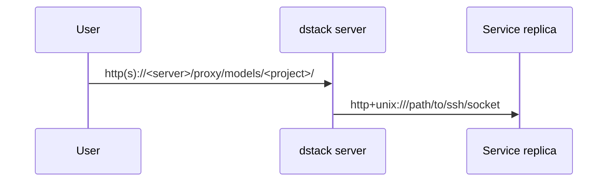
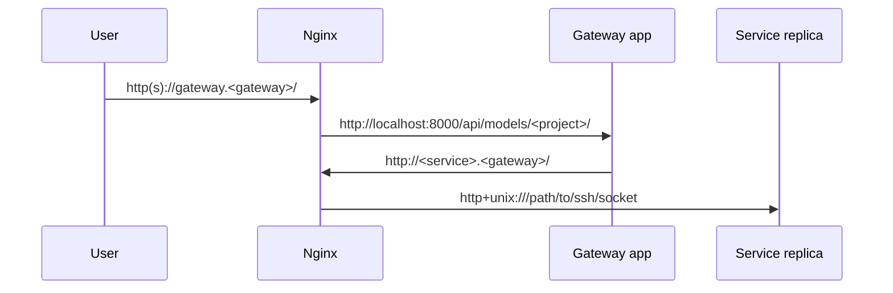
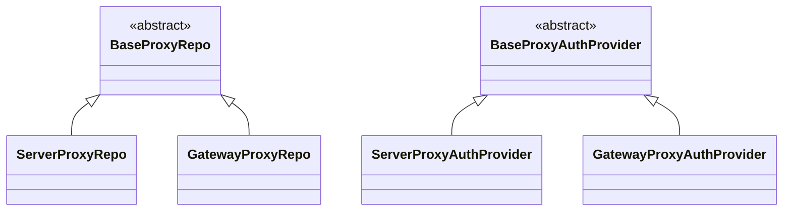
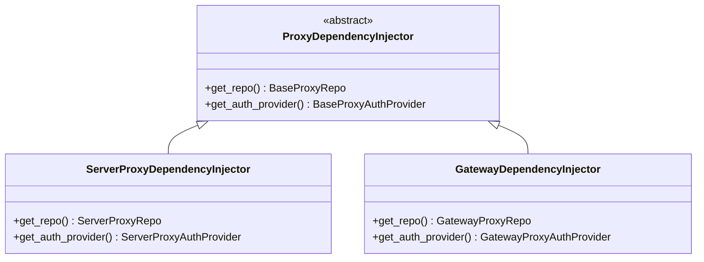

# `dstack-proxy`

`dstack-proxy` is a set of `dstack` components responsible for exposing [services](https://dstack.ai/docs/concepts/services/).

- By default, services are published at `dstack` server URL subpaths. The component that handles traffic to such services is called **in-server proxy**. It runs as part of the `dstack` server. It is implemented in `dstack._internal.server.services.proxy`.
- Users can optionally deploy a **gateway** to handle traffic to their services. The gateway app runs on a dedicated instance. Although it requires additional configuration, it provides higher performance and supports more features than the in-server proxy. It is implemented in `dstack._internal.proxy.gateway`.
- The in-server proxy and the gateway share some business logic, such as the OpenAI-compatible API and the connection pool implementation. The common details are implemented in `dstack._internal.proxy.lib`.

## Proxy functions and modules

### Reverse proxy

`dstack-proxy` acts as a reverse proxy and load balancer for services.

The in-server proxy uses a custom reverse proxy implementation based on FastAPI and httpx. It routes requests based on the `/proxy/services/<project>/<service>` path. It performs load balancing by selecting a random service replica for each forwarded request.

The gateway uses Nginx. It automatically maintains Nginx configs for each service in `/etc/nginx/sites-enabled/*`. Each service is published at a subdomain. Nginx performs load balancing using the round-robin method. Nginx forwards requests directly to service replicas, so traffic does not go through the gateway app.

### HTTPS

The in-server proxy is part of the `dstack` server, so services are only available over HTTPS if the `dstack` server is deployed with HTTPS.

The gateway can enforce HTTPS in the Nginx config. It uses Certbot to obtain TLS certificates from Let's Encrypt or another configured CA when the service is registered, unless the service configuration specifies `https: false`.

### Auth

Unless the service configuration specifies `auth: false`, `dstack-proxy` checks the authorization of incoming requests based on `dstack` user tokens from the `Authorization` header.

The in-server proxy validates the tokens by querying the correct token from the database.

On gateways, Nginx makes a headers-only subrequest to the gateway app to check authorization for each incoming request. The gateway app then makes a request to the `dstack` server to validate the token. Responses from the `dstack` server are cached for 60 seconds. If the `dstack` server does not respond, the incoming request is denied.

### OpenAI-compatible API

The OpenAI interface emulates the real OpenAI API for chat completion models. It can list running models in the project, convert between OpenAI and TGI request formats, and forward requests to the correct service.

The in-server proxy forwards requests directly to service replicas.



The gateway uses Nginx to forward requests so they are included in access logs and service stats.



### Stats collector

`dstack-proxy` collects service usage stats that are then used by the `dstack` server for autoscaling. Stats collection is only supported on gateways and is implemented by reading `/var/log/nginx/dstack.access.log`

### Service connection pool

`dstack-proxy` connects to service replicas via SSH and forwards their service port to a local Unix socket, which is then used by the reverse proxy. All SSH connections are added to a pool and reused between requests.

The in-server proxy opens an SSH connection when it needs to forward the first request to it, so there may be a delay when forwarding the first request.

The gateway opens SSH connections when each replica is registered.

### Communication with the `dstack` server

The in-server proxy is part of the `dstack` server, so no network communication takes place between them.

Gateway-to-server communication happens over an SSH connection that is established by the `dstack` server when it creates a new gateway or starts. The SSH connection includes bidirectional port forwarding, enabling the gateway and the `dstack` server to call each other's APIs:

- The server calls the gateway to register services, fetch stats, etc.
- The gateway calls the server to validate user tokens.

### Storage

`dstack-proxy` has a set of stored models and a common storage repo interface.

The in-server proxy repo implementation fetches the models from the database. It doesn't write to the database, as all the details about services and replicas are written by the `dstack` server.

The gateway maintains its own in-memory storage repo. A copy of the repo is also stored in `~/dstack/state-v2.json`. The copy is updated on every write operation and is used for data recovery after restarts. The repo is populated when new services and replicas are registered.

## Dependency injection

When a module has to be implemented differently for the in-server proxy and the gateway, `dstack-proxy` uses interfaces with multiple implementations. For example, there are common interfaces for the storage repo and for auth checks. The in-server proxy and the gateway provide their own implementations for both interfaces.



`dstack-proxy` then uses dependency injection to select the relevant implementation. Both the in-server proxy and the gateway provide an "injector" class that is used to obtain concrete interface implementations.



An instance of the relevant injector class is stored in the FastAPI global app state and can be accessed from FastAPI path operations. There are helper functions that can be used as FastAPI path operation dependencies to obtain the injector or a module implementation: `get_injector`, `get_proxy_repo`, `get_proxy_auth_provider`, etc.

There are also similar gateway-specific helper functions to obtain gateway-specific module implementations: `get_gateway_proxy_repo` (guaranteed to return the gateway repo, which has more methods than the base repo interface), `get_nginx`, `get_stats_collector`, etc.

## Gateway operations

Gateway instances are managed by the `dstack` server. A gateway is associated with a project and some backend in the project. In `dstack` Sky, there is also a global gateway associated with all projects.

### Creation

Users can create a gateway using the `dstack apply` command. The gateway YAML configuration must specify the gateway's wildcard domain - all direct subdomains should resolve to the gateway IP address. Since the IP address is unknown during provisioning, `dstack` doesn't check DNS records.

Provisioning happens as follows:
1. Launch a non-GPU instance (usually the smallest) with all ports exposed.
2. Install Nginx, Certbot, and patch configs.
3. Create blue-green virtual environments.
4. Install the latest `dstack-gateway` package from the S3 bucket. `dstack-gateway` is a thin package that depends on the `dstack` package, which contains the actual gateway implementation.
5. Run the systemd service `dstack.gateway.service`.

### Update

The gateway has a "blue-green deployment"-like configuration: there are two virtual environments to be swapped on update. The systemd service uses the newly installed package after a restart.

The update process looks like this:
1. Install the new package to the unused venv.
2. Update scripts and systemd service config.
3. Swap the active venv name in `~/dstack/version`.
4. Restart the systemd service.

## Gateway development

The gateway app needs to interact with Nginx and certbot, so running it locally can be challenging. One way to test your code is to upload your development branch to an existing gateway and run the gateway app from source.

1. Run `dstack server` with `DSTACK_SKIP_GATEWAY_UPDATE=1` environment variable. This will prevent `dstack` from updating and starting the standard gateway version on each server restart.

1. Provision a gateway through `dstack`:

   ```shell
   dstack apply -f my-gateway.dstack.yml
   ```

1. Save the gateway key to a file:

   ```shell
   sqlite3 ~/.dstack/server/data/sqlite.db "SELECT ssh_private_key FROM gateway_computes WHERE deleted = 0 AND ip_address = '<gateway-ip-addr>'" > /tmp/gateway.key
   chmod 600 /tmp/gateway.key
   ```

1. Deliver your code to the gateway. For example, clone it from a remote repo:

   ```shell
   ssh -i /tmp/gateway.key ubuntu@gateway.example "git clone https://github.com/dstackai/dstack.git ~/dstack-repo"
   ```

   Or push it from your machine:

   ```shell
   ssh -i /tmp/gateway.key ubuntu@gateway.example "git init ~/dstack-repo"
   git remote add gateway ubuntu@gateway.example:~/dstack-repo
   GIT_SSH_COMMAND='ssh -i /tmp/gateway.key' git push gateway branch_name
   ```

1. Connect to the gateway:

   ```shell
   ssh -i /tmp/gateway.key ubuntu@gateway.example
   ```

1. Prepare an environment with your development branch on the gateway:

   ```shell
   cd ~/dstack-repo
   git checkout branch_name
   curl -LsSf https://astral.sh/uv/install.sh | sh
   source ~/.local/bin/env
   uv sync --extra gateway
   ```

1. Stop the gateway service and start your development version from source:

   ```shell
   sudo systemctl stop dstack.gateway.service
   uv run uvicorn dstack._internal.proxy.gateway.main:app
   ```
