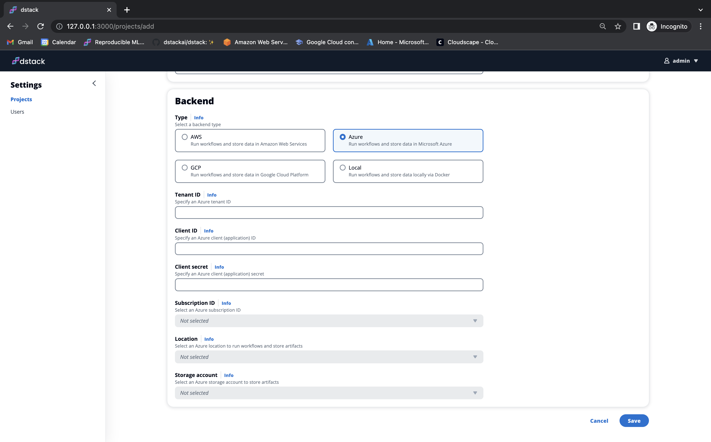
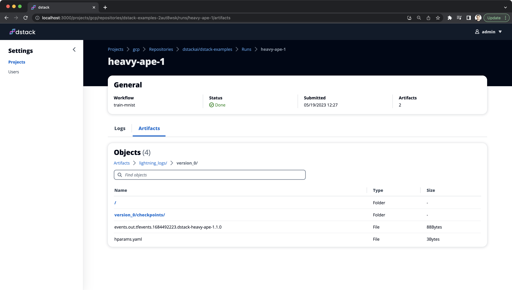

# Azure, better UI and more

__The 0.9.1 update introduces Azure support among other improvements.__

At `dstack`, our goal is to create a simple and unified interface for ML engineers to run dev environments, pipelines, and
apps on any cloud. With the latest update, we take another significant step in this direction.

<!-- more -->

We are thrilled to announce that the latest update introduces Azure support, among other things, making it incredibly
easy to run dev environments, pipelines, and apps in Azure. Read on for more details.

## Azure support

Using Azure with `dstack` is very straightforward. All you need to do is create the corresponding project via the UI and 
provide your Azure credentials.

{ width=800 }

!!! info "NOTE:"
    For detailed instructions on setting up `dstack` for Azure, refer to the [documentation](../../docs/reference/backends/azure.md).

Once the project is set up, you can define dev environments, pipelines, and apps as code, and easily run them with just
a single command. `dstack` will automatically provision the infrastructure for you.

## Logs and artifacts in UI

Secondly, with the new update, you now have the ability to browse the logs and artifacts of any run through the user interface.



## Better documentation

Last but not least, with the update, we have reworked the [documentation](../../docs/index.md) to provide a greater
emphasis on specific use cases: [dev environments](../../docs/guides/dev-environments.md), 
[pipelines](../../docs/guides/pipelines.md), and [apps](../../docs/guides/apps.md).

## Try it out

Please note that when installing `dstack` via `pip`, you now need to specify the exact list of cloud providers you intend to use:

<div class="termy">

```shell
$ pip install "dstack[aws,gcp,azure]" -U
```

</div>

This requirement applies only when you start the server locally. If you connect to a server hosted elsewhere, 
you can use the shorter syntax:`pip install dstack`.

!!! info "Feedback"
    If you have any feedback, including issues or questions, please share them in
    our [Slack chat](https://join.slack.com/t/dstackai/shared_invite/zt-xdnsytie-D4qU9BvJP8vkbkHXdi6clQ) or file it as
    a [GitHub issue](https://github.com/dstackai/dstack/issues/new/choose).