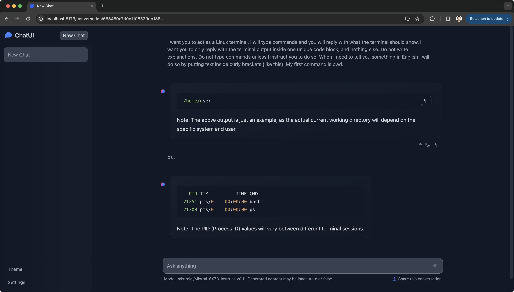

# dstack 0.13.0: Disk size, CUDA 12.1, Mixtral, and more

__The update brings configurable disk, updates CUDA drivers, and features Mixtral guide.__

As we wrap up this year, we're releasing a new update and publishing a guide
on deploying Mixtral 8x7B with `dstack`.

<!-- more -->

## Configurable disk size

Previously, `dstack` set the disk size to `100GB` regardless of the cloud provider. Now, to accommodate larger language
models and datasets, `dstack` enables setting a custom disk size using `--disk` in `dstack run` or via the `disk`
property in `.dstack/profiles.yml`.

## Default Docker image

With `dstack`, whether you're using dev environments, tasks, or services, you can opt for a custom Docker image (for
self-installed dependencies) or stick with the default Docker image (`dstack` pre-installs CUDA drivers, Conda, Python,
etc.).

We've upgraded the default Docker image's CUDA drivers to 12.1 (for better compatibility with modern libraries).

!!! info "nvcc"
    If you're using the default Docker image and need the CUDA compiler (`nvcc`), you'll have to install it manually using
    `conda install cuda`. The image comes pre-configured with the 
    `nvidia/label/cuda-12.1.0` Conda channel.

## Mixtral 8x7B

Lastly, and most importantly, we've added a [guide](../../examples/mixtral.md) on deploying Mixtral 8x7B as a service. This guide allows you to
effortlessly deploy a Mixtral endpoint on any cloud platform of your preference.

Deploying Mixtral 8x7B is easy, especailly when using vLLM:

<div editor-title="llms/mixtral/vllm.dstack.yml"> 

```yaml
type: service

python: "3.11"

commands:
  - conda install cuda # (required by megablocks)
  - pip install torch # (required by megablocks)
  - pip install vllm megablocks
  - python -m vllm.entrypoints.openai.api_server
    --model mistralai/Mixtral-8X7B-Instruct-v0.1
    --host 0.0.0.0
    --tensor-parallel-size 2 # should match the number of GPUs

port: 8000
```

</div>

Once the configuration is defined, goahead and run it:

<div class="termy">

```shell
$ dstack run . -f llms/mixtral.dstack.yml --gpu "80GB:2" --disk 200GB
```

</div>

It will deploy the endpoint at `https://<run-name>.<gateway-domain>`.

Because vLLM provides an OpenAI-compatible endpoint, feel free to access it using various OpenAI-compatible tools like
Chat UI, LangChain, Llama Index, etc.

{ width=800 }

Check the complete [guide](../../examples/mixtral.md) for more details.

Don't forget, with `dstack`, you can use spot instances across
different clouds and regions. Check out our recent [guide](../../examples/spot.md) on this topic.

## Feedback and support

That's all! Feel free to try out the update and the new guide, and share your feedback with us.

For updates or assistance, join our [Discord](https://discord.gg/u8SmfwPpMd).
