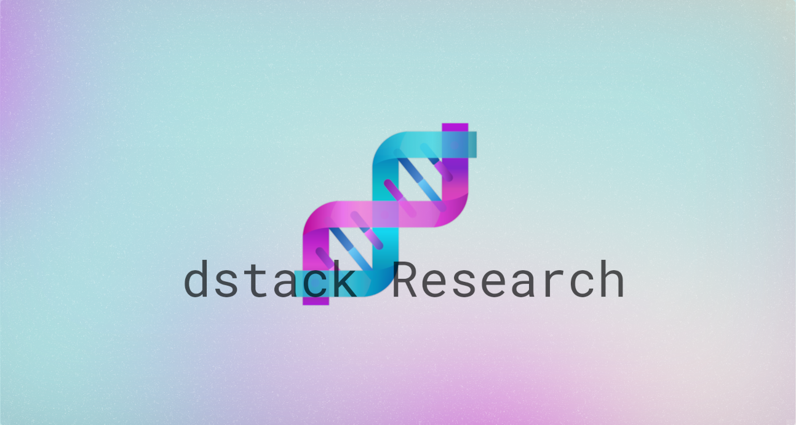
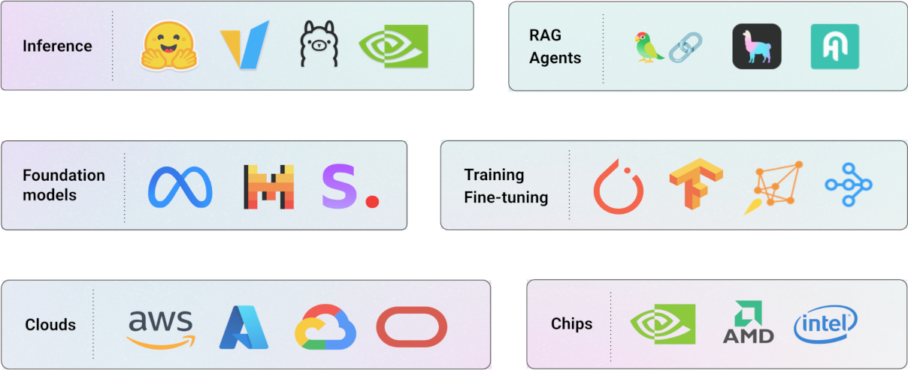

# Launching research and open-source program

To all universities and research labs developing open-source AI: If you're utilizing cloud GPUs or on-prem clusters
to train and deploy AI, you can now use `dstack Enterprise` for free.

{ width=650 }

<!-- more -->

As recent developments show, access to and the ability to efficiently manage compute resources are key to training and
utilizing AI models. Inefficiency in these processes leads to high costs and erodes competitiveness in the race for AI
research.

Universities and research labs working on open-source AI do more research than any other organizations. They require a
lot of compute and often prefer focusing on AI rather than infrastructure.

`dstack` is building an open-source foundation for more effective orchestration of compute resources for AI workloads.

{ width=750 }

Leveraging containers, `dstack` facilitates AI model training and deployment at scale while allowing the effective
use of open-source models, training, and serving frameworks.

`dstack Enterprise` is a self-hosted AI platform that extends the capabilities of the open-source `dstack` to simplify
cost optimization, and compute utilization, and workload management for multiple teams.

> To support universities and research labs engaged in open-source AI, we're thrilled to announce that `dstack Enterprise`
> can now be used by them for free

If you're a researcher facing GPU usage challenges and seeking a platform friendly to AI researchers, capable of
seamless integration with the open-source ecosystem, share this program with your supervisor.

To apply to this program, fill [this](https://tally.so/r/nrl2l5) form.