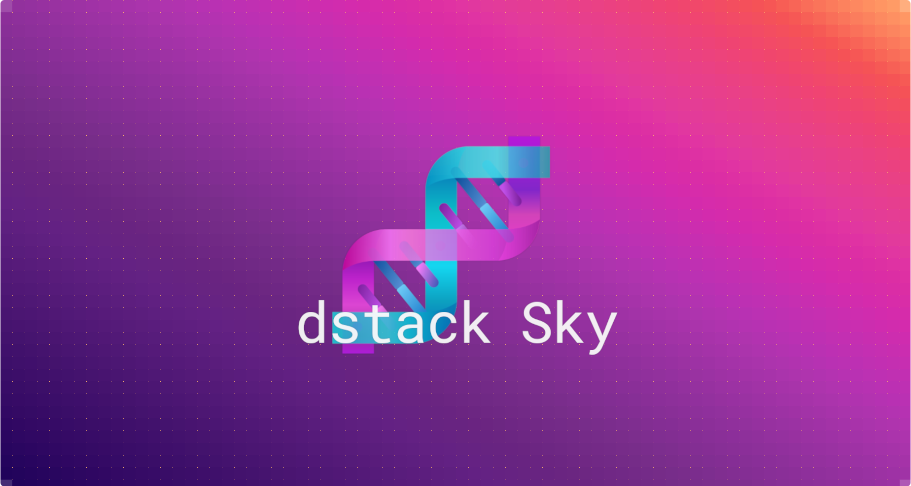

# Introducing dstack Sky

Today we're previewing `dstack Sky`, a service built on top of 
`dstack` that enables you to get GPUs at competitive rates from a wide pool of providers.

{ width=650 }

<!-- more -->

## TL;DR

- GPUs at competitive rates from multiple providers
- No need for your own cloud accounts
- Compatible with `dstack`'s CLI and API
- A pre-configured gateway for deploying services

## Introduction

`dstack` is an open-source tool designed for managing AI infrastructure across various cloud platforms. It's lighter and
more specifically geared towards AI tasks compared to Kubernetes.

Due to its support for multiple cloud providers, `dstack` is frequently used to access on-demand and spot GPUs 
across multiple clouds. 
From our users, we've learned that managing various cloud accounts, quotas, and billing can be cumbersome.

To streamline this process, we introduce `dstack Sky`, a managed service that enables users to
access GPUs from multiple providers through `dstack` – without needing an account in each cloud provider. 

## What is dstack Sky?

Instead of running `dstack server` yourself, you point `dstack config` to a project
set up with `dstack Sky`.

<div class="termy">

```shell
$ dstack config --url https://sky.dstack.ai \
    --project my-awesome-project \
    --token ca1ee60b-7b3f-8943-9a25-6974c50efa75
```

</div>

Now, you can use `dstack`'s CLI or API – just like you would with your own cloud accounts.

<div class="termy">

```shell
$ dstack run . -b tensordock -b vastai

 #  BACKEND     REGION  RESOURCES                    SPOT  PRICE 
 1  vastai      canada  16xCPU/64GB/1xRTX4090/1TB    no    $0.35
 2  vastai      canada  16xCPU/64GB/1xRTX4090/400GB  no    $0.34
 3  tensordock  us      8xCPU/48GB/1xRTX4090/480GB   no    $0.74
    ...
 Shown 3 of 50 offers, $0.7424 max

Continue? [y/n]:
```

</div>

!!! info "Backends"
    `dstack Sky` supports the same [backends](../../docs/installation/index.md) as the open-source version, except that you
    don't need to set them up. By default, it uses all supported backends.

You can use both on-demand and spot instances without needing to manage quotas, as they are automatically handled
for you.

With `dstack Sky` you can use all of `dstack`'s features, incl. [dev environments](../../docs/concepts/dev-environments.md), 
[tasks](../../docs/concepts/tasks.md), [services](../../docs/concepts/services.md), and 
[fleets](../../docs/concepts/fleets.md).

To publish services, the open-source version requires setting up a gateway with your own domain. 
`dstack Sky` comes with a pre-configured gateway.

<div class="termy">

```shell
$ dstack gateway list
 BACKEND  REGION     NAME    ADDRESS       DOMAIN                            DEFAULT
 aws      eu-west-1  dstack  3.252.79.143  my-awesome-project.sky.dstack.ai  ✓
```

</div>

If you run it with `dstack Sky`, the service's endpoint will be available at
`https://<run name>.<project name>.sky.dstack.ai`.

Let's say we define a service:

<div editor-title="serve.dstack.yml"> 

```yaml
type: service
# Deploys Mixtral 8x7B with Ollama

# Serve model using Ollama's Docker image
image: ollama/ollama
commands:
  - ollama serve &
  - sleep 3
  - ollama pull mixtral
  - fg
port: 11434

# Configure hardware requirements
resources:
  gpu: 48GB..80GB

# Enable OpenAI compatible endpoint
model: mixtral
```
</div>

If it has a `model` mapping, the model will be accessible
at `https://gateway.<project name>.sky.dstack.ai` via the OpenAI compatible interface.

```python
from openai import OpenAI


client = OpenAI(
  base_url="https://gateway.<project name>.sky.dstack.ai",
  api_key="<dstack token>"
)

completion = client.chat.completions.create(
  model="mixtral",
  messages=[
    {"role": "user", "content": "Compose a poem that explains the concept of recursion in programming."}
  ]
)

print(completion.choices[0].message)
```

Now, you can choose &mdash; either use `dstack` via the open-source version or via `dstack Sky`, 
or even use them side by side.

!!! info "Credits"
    Are you an active contributor to the AI community? [Request](https://tally.so/r/3xYlYG) free `dstack Sky` credits.

[//]: # (Need help, have questions, or simply want to stay updated? )

`dstack Sky`  is live on [Product Hunt](https://www.producthunt.com/posts/dstack-sky). Support it by giving it your vote!

[Join Discord](https://discord.gg/u8SmfwPpMd){ .md-button .md-button-secondary .discord .small .external }
