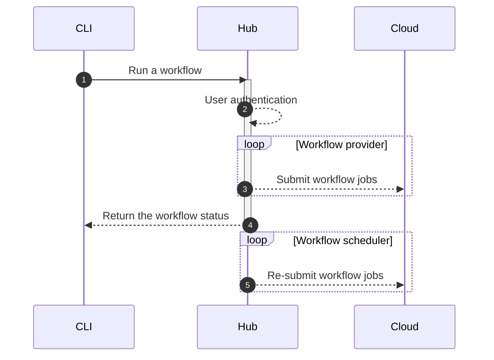

# Introducing dstack Hub

__A new tool for teams to manage their ML workflows.__

Last October, we open-sourced the `dstack` CLI for defining ML workflows as code and running them easily on any cloud or
locally. The tool abstracts ML engineers from vendor APIs and infrastructure, making it convenient to run scripts,
development environments, and applications.

<!-- more -->

Today, we are excited to announce an extension of `dstack` called Hub, specifically designed for teams. The purpose of Hub
is to provide a unified interface that enables teams to effectively manage their model development workflows on any
cloud.

## How does it work?

Before, `dstack` CLI could configure a cloud account as a remote, so CLI commands could use local cloud credentials to
make requests directly to the cloud. Now, `dstack` CLI can also configure Hub as a remote, and Hub can make requests to
the cloud on behalf of the user using the credentials stored in Hub.

In addition to authentication and credential storage, Hub comes with a built-in workflow scheduler. For example, 
it is capable of monitoring the availability of spot instances and automatically resubmitting jobs.

## Why does it matter?

Developing models is no longer reserved exclusively for tech giants. 
Smaller companies and ML engineers alike seek easy-to-use tools to automate ML workflows.
They want developer-friendly options that can be used with their preferred IDEs and frameworks and don't tie them to a
particular vendor.

Finally, `dstack` intentionally does not rely on Kubernetes, making it flexible enough to support cloud providers without public
Kubernetes support, while still planning to add Kubernetes as a possible integration.

## Try it now

Here's a quick guide to get started with Hub:

1. Launch the server (using Docker)
2. Visit the URL provided in the output to log in as an administrator
3. Create a project and configure its backend (AWS or GCP)
4. Configure the CLI to use the project as a remote

For more details, visit the [Hub](../../setup/hub.md) documentation. 

## What's next?

#### Python SDK and REST API

Currently, the only way to run or manage workflows is through the `dstack` CLI. There are scenarios when you'd prefer to run
workflows other ways, e.g. from code or programmatically via API. To support these scenarios, we plan to release soon
Python SDK and REST API.

#### More workflow scheduler capabilities

The built-in scheduler currently monitors spot instance availability and automatically resubmits jobs. Our plan is to
enhance this feature and include additional capabilities. Users will be able to track cloud compute usage, and manage
quotes per team via the user interface.

[//]: # (#### User interface)

[//]: # (Furthermore, the user interface will continue to evolve, ultimately providing the same functionality as the CLI.)

#### More cloud backends

Lastly, and of utmost importance, we plan to extend support to other cloud platforms, not limiting ourselves to AWS,
GCP, and Azure.

## Contribution

You are encouraged to report any bugs, suggest new features, and provide feedback to improve Hub
through [GitHub issues](https://github.com/dstackai/dstack/issues/new/choose).

If you wish to have `dstack` support additional workflow [providers](../../usage/providers.md) or
cloud [backends](../../setup/index.md#configure-a-remote),
and are willing to contribute to the cause, please get in touch with us
through [Slack](https://join.slack.com/t/dstackai/shared_invite/zt-xdnsytie-D4qU9BvJP8vkbkHXdi6clQ)
or [Twitter](https://twitter.com/dstackai).
