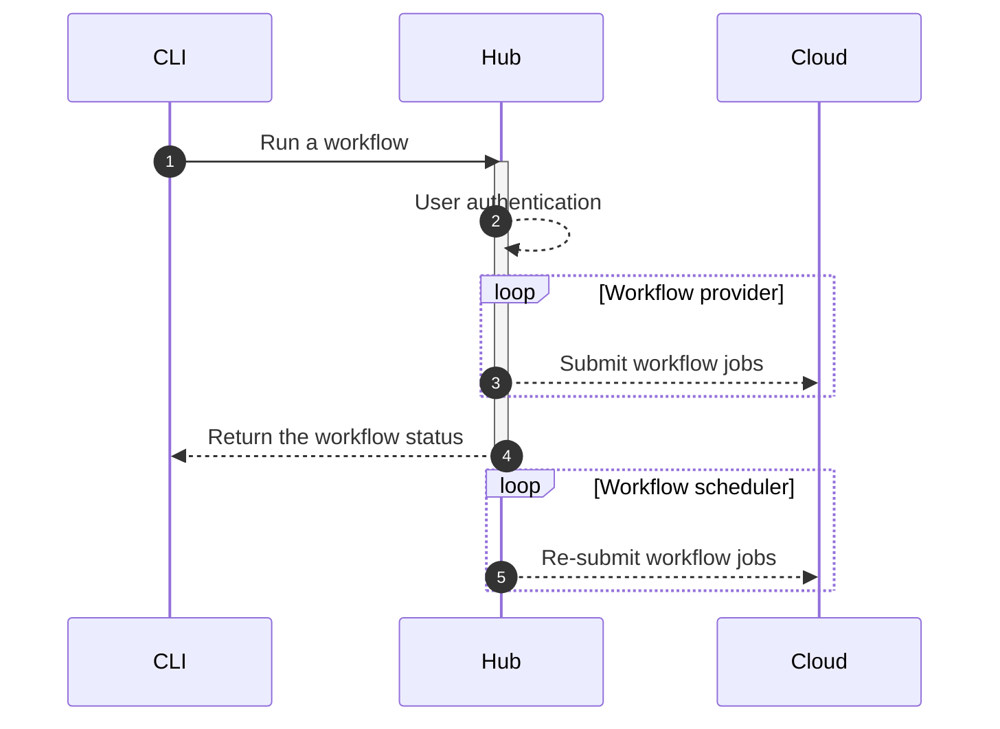

# dstack 0.7.0: Introducing dstack server

__The latest update introduces the server with UI, team management, and more.__

Last October, we open-sourced the `dstack` CLI for defining ML workflows as code and running them easily on any cloud or
locally. The tool abstracts ML engineers from vendor APIs and infrastructure, making it convenient to run scripts,
development environments, and applications.

<!-- more -->

Today, we are excited to announce a preview of `Hub`, a new way to use dstack for teams to manage their model development
workflows effectively on any cloud platform.

## How does it work?

Previously, the `dstack` CLI configured a cloud account as a remote to use local cloud credentials for direct requests to
the cloud. Now, the CLI allows configuration of Hub as a remote, enabling requests to the cloud using user credentials
stored in Hub.

The Hub not only provides basic features such as authentication and credential storage, but it also has built-in
workflow scheduling capabilities. For instance, it can monitor the availability of spot instances and automatically
resubmit jobs.

## Why does it matter?

As you start developing models more regularly, you'll encounter the challenge of automating your ML workflows to reduce
time spent on infrastructure and manual work.

While many cloud vendors offer tools to automate ML workflows, they do so through opinionated UIs and APIs, leading to a
suboptimal developer experience and vendor lock-in.

In contrast, `dstack` aims to provide a non-opinionated and developer-friendly interface that can work across any 
vendor.

## Try the preview

Here's a quick guide to get started with Hub:

1. Start the Hub application
2. Visit the URL provided in the output to log in as an administrator
3. Create a project and configure its backend (AWS or GCP)
4. Configure the CLI to use the project as a remote

For more details, visit the [Hub](../../docs/index.md#configure-the-hub) documentation. 

## What's next?

Currently, the only way to run or manage workflows is through the `dstack` CLI. There are scenarios when you'd prefer to run
workflows other ways, e.g. from Python code or programmatically via API. To support these scenarios, we plan to release soon
Python SDK and REST API.

The built-in scheduler currently monitors spot instance availability and automatically resubmits jobs. Our plan is to
enhance this feature and include additional capabilities. Users will be able to track cloud compute usage, and manage
quotes per team via the user interface.

Lastly, and of utmost importance, we plan to extend support to other cloud platforms, not limiting ourselves to AWS,
GCP, and Azure.

## Contribution

You are encouraged to report any bugs, suggest new features, and provide feedback to improve Hub
through [GitHub issues](https://github.com/dstackai/dstack/issues/new/choose).

[//]: # (If you wish to have `dstack` support additional workflow [providers]&#40;../../docs/reference/providers/bash.md&#41; or)
[//]: # (cloud backends,)
[//]: # (and are willing to contribute to the cause, please get in touch with us)
[//]: # (through [Discord]&#40;https://discord.gg/u8SmfwPpMd&#41;)
[//]: # (or [Twitter]&#40;https://twitter.com/dstackai&#41;.)
