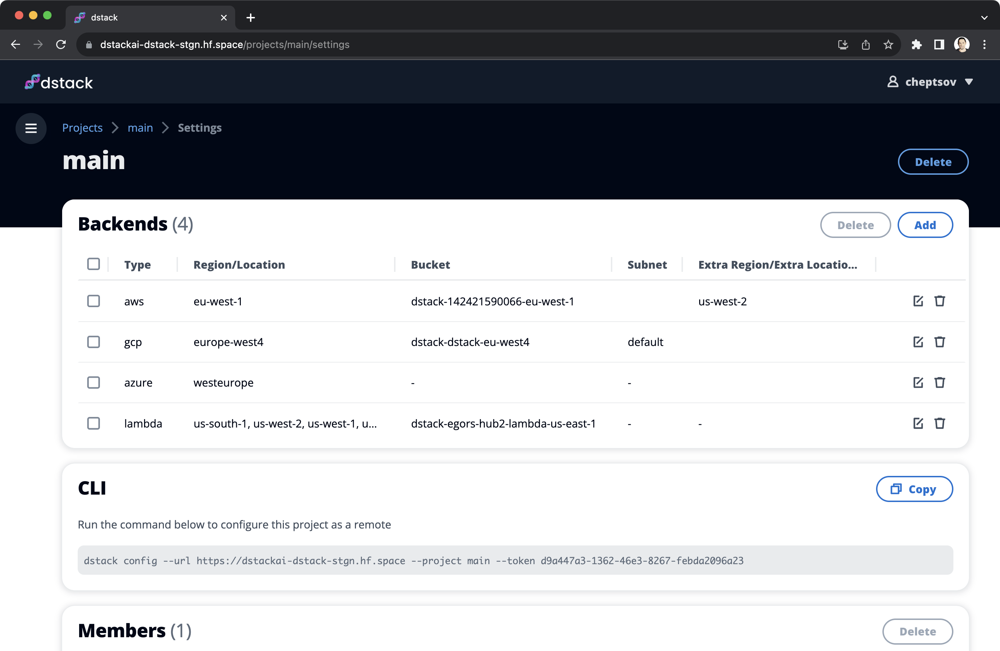

# dstack 0.11.0: Multi-cloud and multi-region projects

__The latest update now automatically finds the cheapest GPU across clouds and regions.__

The latest release of `dstack` enables the automatic discovery of the best GPU price and availability across multiple
configured cloud providers and regions.

<!-- more -->

## Multiple backends per project

Now, `dstack` leverages price data from multiple configured cloud providers and regions to automatically suggest the
most cost-effective options.

<div class="termy small">

```shell
$ dstack run . -f llama-2/train.dstack.yml --gpu A100

 Configuration       llama-2/train.dstack.yml
 Min resources       2xCPUs, 8GB, 1xA100
 Max price           no
 Spot policy         auto
 Max duration        72h

 #  BACKEND  RESOURCES                      SPOT  PRICE
 2  lambda   30xCPUs, 200GB, 1xA100 (80GB)  yes   $1.1
 3  gcp      12xCPUs, 85GB, 1xA100 (40GB)   yes   $1.20582
 1  azure    24xCPUs, 220GB, 1xA100 (80GB)  yes   $1.6469
    ...

Continue? [y/n]:
```

</div>

The default behavior of `dstack` is to first attempt the most cost-effective options, provided they are available. You
have the option to set a maximum price limit either through `max_price` in `.dstack/profiles.yml` or by using
`--max-price` in the `dstack run` command.

To implement this change, we have modified the way projects are configured. You can now configure multiple clouds and
regions within a single project.

{ width=800 }

!!! info "Why this matter?"
    The ability to run LLM workloads across multiple cloud GPU providers
    allows for a significant reduction in costs and an increase in availability,
    while also remaining independent of any particular cloud vendor.

We hope that the value of `dstack` will continue to grow as we expand our support for additional cloud GPU providers.
If you're interested in a specific provider, please message us on [Discord](https://discord.gg/u8SmfwPpMd).

## Custom domains and HTTPS

In other news, it is now possible to deploy services
using [HTTPS](../../docs/guides/services.md#configure-a-domain-and-enable-https-optional).
All you need to do is configure a wildcard domain (e.g., `*.mydomain.com`), point it to the gateway IP address, and then
pass the subdomain you want to use (e.g., `myservice.mydomain.com`) to the `gateway` property in
YAML (instead of the gateway IP address).

## Other changes

### .dstack/profiles.yml

 - The `project` property is no longer supported.
 - You can now use `max_price` to set the maximum price per hour in dollars.

### dstack run

Using the dstack run command, you are now able to utilize options such as `--gpu`, `--memory`, `--env`, `--max-price`,
and several [other arguments](../../docs/reference/cli/index.md#dstack-run) to override the profile settings.

Lastly, the local backend is no longer supported. Now, you can run everything using only a cloud backend.

The [documentation](../../docs/index.md) is updated to reflect the changes in the release.

!!! warning "Migration to 0.11"
    The `dstack` version 0.11 update brings significant changes that break backward compatibility. If you used prior `dstack`
    versions, after updating to `dstack==0.11`, you'll need to log in to the UI and reconfigure clouds. 

    We apologize for any inconvenience and aim to ensure future updates maintain backward compatibility.
    
## Give it a try

Getting started with `dstack` takes less than a minute. Go ahead and give it a try.

<div class="termy">

```shell
$ pip install "dstack[aws,gcp,azure,lambda]" -U
$ dstack start
```

</div>