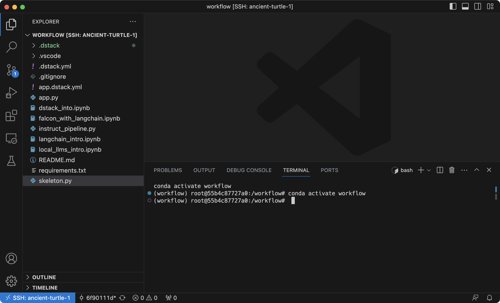

# New configuration format and CLI experience

__The 0.10 update is out with refined configuration format and CLI experience.__

This is the most massive and feature-loaded update of `dstack` in the last several months.
The update introduces a brand-new way to configure and run dev environments and tasks,
making it a lot more convenient to use.

<!-- more -->

Read below about the important changes.

## New configuration format

The format of the YAML files has been entirely reworked.

1. **Filename:** The configuration files are not defined under `.dstack/workflows` anymore.
Now you can put them anywhere within your project.
The configuration file must be named with the suffix `.dstack.yml` (e.g. `.dstack.yml` or `app.dstack.yml`.) 

2. **Type:** The format of the files has been [changed](../../docs/reference/dstack.yml/index.md). 
    The `provider` property has been replaced with `type` that supports two possible values: `dev-environment` and `task`.
    
    ### Dev environments
    
    Below is an example of a `dev-environment` configuration:
    
    <div editor-title=".dstack.yml"> 
    
    ```yaml
    type: dev-environment
    setup:
      - pip install -r requirements.txt
    ide: vscode
    ```
    
    </div>
    
    ### Tasks
    
    Here's an example of a `task` configuration:
    
    <div editor-title="app.dstack.yml"> 
    
    ```yaml
    type: task
    setup:
      - pip install -r requirements.txt
    ports:
      - 7860
    commands:
      - gradio app.py
    ```
    
    </div>

3. **Profiles:** The `resources` property is not part of the configuration files anymore.
Instead, resources must be defined via [`.dstack/profiles.yml`](../../docs/reference/profiles.yml.md).

    Here's an example of this file:
    
    <div editor-title=".dstack/profiles.yaml"> 
    
    ```yaml
    profiles:
      - name: gpu-large
        project: gcp
        resources:
           memory: 48GB
           gpu:
             memory: 24GB
        default: true
    ```
    
    </div>
   
    Once you've defined a profile, you can reuse it with the `dstack run` command via the `--profile` argument.

4. **Ports:** The `ports` property now allows you to specify port numbers directly, without using the `PORT_0`, `PORT_1`,
   etc. environment variables. Moreover, you are not required to bind the ports to `0.0.0.0` in order to access them.
   `dstack` securely forwards your ports bound to `127.0.0.1` to your local machine.

5. **Artifacts:**: The `artifacts` property is no longer supported. For working with artifacts, it is now recommended to
   use the new Python API (more details to come later).

## Updated CLI experience

The interface of the `dstack run` command has changed significantly.
Now, instead of specifying the name of the workflow, the command accepts the path to the working directory that you want
to use as the working directory when running the configuration.

```shell
$ dstack run . 
```

If you've not specified a specific configuration file, it will the `.dstack.yml` configuration in the given directory.
If you want to use a non-default configuration, use can use the `-f` argument.

<div class="termy">

```shell
$ dstack run . -f app.dstack.yml
```

</div>

### Execution plan

Also, the `dstack run` command now shows you the plan by default, which outlines the project and resources it will
utilize. This allows you to review and confirm them.

```shell
$ dstack run .

dstack will execute the following plan:

 CONFIGURATION  USER   PROJECT  INSTANCE       RESOURCES                 SPOT
 .dstack.yml    admin  gcp      a2-highgpu-1g  12xCPUs, 87040MB, 1xA100  yes

Continue? [y/n]: y
```

## VS Code desktop integration

Now, if you use the `dev-environment` configuration type with the `ide` property set to `vscode`, the `dstack run` command will
generate a URL for opening the development environment using your desktop VS Code.

```shell
$ dstack run . 

 RUN                USER   INSTANCE       STATUS     SUBMITTED 
 ancient-turtle-11  admin  a2-highgpu-1g  Submitted  54 secs ago        
 
Starting SSH tunnel...

To open in VS Code Desktop, use one of these link:
  vscode://vscode-remote/ssh-remote+ancient-turtle-11/workflow
  
To exit, press Ctrl+C.
```

If you click on the URL, it will automatically open your development environment using your desktop VS Code.

{ width=800 }

## Other important changes

Last but not least, here's a brief list of other improvements:

 * If you are using AWS, `dstack` now supports instance types with the `A10G` GPU.
 * The `dstack` server now allows you to configure projects using the default cloud credentials (if they are
   configured on the machine where the server is running).
 * We've introduced a new Python API and UI for working with artifacts (more details to come later this week).

The [documentation](../../docs/index.md) and [examples](../../examples/index.md)
are updated to reflect the changes.

!!! info "Try the update and share feedback"
    Go ahead, and install the updated version, give it a spin, and share your feedback in
    our [Discord community](https://discord.gg/u8SmfwPpMd).

