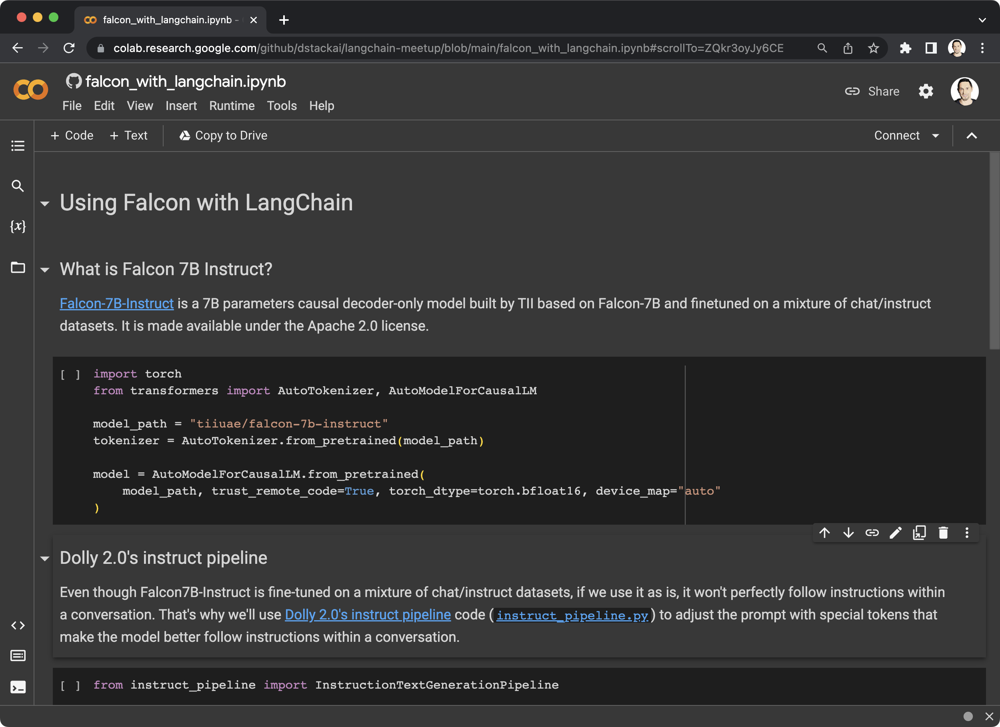
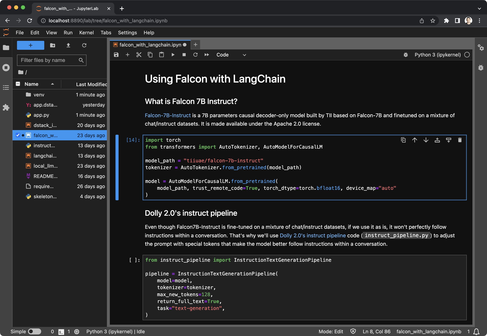
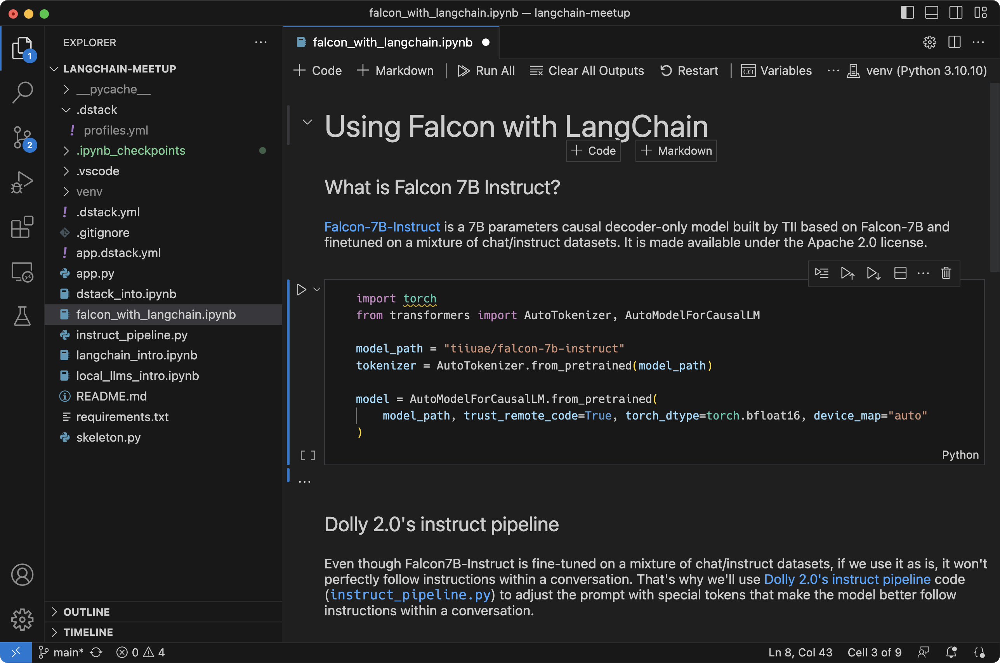

# Say goodbye to managed notebooks

__Why managed notebooks are losing ground to cloud dev environments.__

Data science and ML tools have made significant advancements in recent years. This blog post aims to examine the
advantages of cloud dev environments (CDE) for ML engineers and compare them with web-based managed notebooks.

[//]: # (TODO: Should be technical and controversial)

<!-- more -->

## Notebooks are here to stay

Jupyter notebooks are instrumental for interactive work with data. They provide numerous advantages such as high
interactivity, visualization support, remote accessibility, and effortless sharing.

Managed notebook platforms, like Google Colab and AWS SageMaker have become popular thanks to their easy integration with clouds.
With pre-configured environments, managed notebooks remove the need to worry about infrastructure.

{ width=800 }

## Reproducibility challenge

As the code evolves, it needs to be converted into Python scripts and stored in Git for improved organization and
version control. Notebooks alone cannot handle this task, which is why they must be a part of a developer
environment that also supports Python scripts and Git.

The JupyterLab project attempts to address this by turning notebooks into an IDE by adding a file browser,
terminal, and Git support.

{ width=800 }

## IDEs get equipped for ML

Recently, IDEs have improved in their ability to support machine learning. They have started to combine the benefits of
traditional IDEs and managed notebooks. 

IDEs have upgraded their remote capabilities, with better SSH support. Additionally, they now offer built-in support for editing notebooks.

Two popular IDEs, VS Code and PyCharm, have both integrated remote capabilities and seamless notebook editing features.

{ width=800 }

## The rise of app ecosystem

Notebooks have been beneficial for their interactivity and sharing features. However, there are new alternatives like
Streamlit and Gradio that allow developers to build data apps using Python code. These frameworks not only simplify
app-building but also enhance reproducibility by integrating with Git. 

Hugging Face Spaces, for example, is a popular tool today for sharing Streamlit and Gradio apps with others.

{ width=800 class="border"}

## Say hello to cloud dev environments!

Remote development within IDEs is becoming increasingly popular, and as a result, cloud dev environments have emerged as
a new concept. Various managed services, such as Codespaces and GitPod, offer scalable infrastructure while maintaining
the familiar IDE experience.

One such open-source tool is `dstack`, which enables you to define your dev environment declaratively as code and run it on any cloud.

<div editor-title=".dstack.yml"> 

```yaml
type: dev-environment
build:
  - apt-get update
  - apt-get install -y ffmpeg
  - pip install -r requirements.txt
ide: vscode
```

</div>

With this tool, provisioning the required hardware, setting up the pre-built environment (no Docker is needed), and
fetching your local code is automated.

```shell
$ dstack run .

 RUN                 CONFIGURATION  USER   PROJECT  INSTANCE       SPOT POLICY
 honest-jellyfish-1  .dstack.yml    peter  gcp      a2-highgpu-1g  on-demand

Starting SSH tunnel...

To open in VS Code Desktop, use one of these link:
  vscode://vscode-remote/ssh-remote+honest-jellyfish-1/workflow
  
To exit, press Ctrl+C.
```

You can securely access the cloud development environment with the desktop IDE of your choice.

{ width=800 }

!!! info "Learn more"
    Check out our [guide](../../docs/concepts/dev-environments.md) for running dev environments in your cloud.