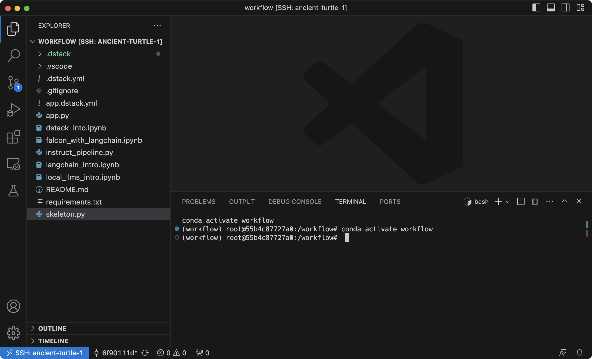

# Using OSS LLMs with LangChain in the cloud

__A tutorial explaining how to build a chatbot using OSS LLMs on your cloud.__

LangChain makes it easier to use LLMs for app development, which is why many people want to use it.
This tutorial shows how to use LangChain with OSS LLMs on your own cloud, using the example of building a chatbot with
Falcon.

<!-- more -->

## Introduction

It can be used with closed-source LLMs such as OpenAI, as well as with any other variations, including OSS LLMs or those
fine-tuned based on OSS LLMs.

Here's an example of using LangChain with a local LLM loaded from Hugging Face Hub.

```python
from langchain import PromptTemplate, LLMChain, HuggingFacePipeline

llm = HuggingFacePipeline.from_model_id(model_id="bigscience/bloom-1b7", task="text-generation",
                                        model_kwargs={"temperature": 0, "max_length": 64})

template = """Question: {question}

Answer: Let's think step by step."""

prompt = PromptTemplate(template=template, input_variables=["question"])

llm_chain = LLMChain(prompt=prompt, llm=llm)

question = "What is electroencephalography?"

print(llm_chain.run(question))
```

!!! info "NOTE:"
    Running LLMs on the same machine can be particularly convenient during the development stage when you don't necessarily need your
    model to be deployed.

Let's see how to use OSS LLMs with LangChain, using the example of building a chatbot with Falcon and Gradio.

## Setting up a dev environment with dstack

Since we'll be developing in the cloud, we'll use `dstack` to streamline the process of setting up dev
environments and running ML tasks.

`dstack` allows you to define dev environments and tasks as code, and then run them conveniently in your cloud with a
single command.

Before using `dstack`, you need to define one or several profiles with a list of resources you want to use.

Since we're going to use Falcon-7B-Instruct, we will need a GPU with at least 24GB of memory, as well as at least 48GB
of RAM.

<div editor-title=".dstack/profiles.yml">

```yaml
profiles:
  - name: gcp-large
    project: gcp
    resources:
      memory: 48GB
      gpu:
        memory: 24GB
    default: true
```

</div>

After defining the profile, place the following file in your project's root folder to create a dev environment
configuration.

<div editor-title=".dstack.yml">

```yaml
type: dev-environment
setup:
  - pip install -r requirements.txt
ide: vscode
```

</div>

Now, you can proceed and run this configuration using the `dstack` CLI.

<div class="termy">

```shell
$ dstack run . 

 RUN                USER   INSTANCE       STATUS     SUBMITTED 
 ancient-turtle-11  admin  a2-highgpu-1g  Submitted  54 secs ago        

Provisioning and starting SSH tunnel...
---> 100%

To open in VS Code Desktop, use one of these link:
  vscode://vscode-remote/ssh-remote+ancient-turtle-11/workflow

To exit, press Ctrl+C.
```

</div>

`dstack` will automatically create the required cloud resources, fetch your local code, and invite you to open it in your desktop IDE.



## Loading the Falcon-7B-Instruct pipeline

Now that you have set up the dev environment with the required GPU and memory, you can load the Falcon model
from the Hugging Face Hub.

```python
import torch
from transformers import AutoTokenizer, AutoModelForCausalLM

model_path = "tiiuae/falcon-7b-instruct"
tokenizer = AutoTokenizer.from_pretrained(model_path)

model = AutoModelForCausalLM.from_pretrained(
    model_path, trust_remote_code=True, torch_dtype=torch.bfloat16, device_map="auto"
)
```

!!! info "Using Dolly 2.0's instruct pipeline"

    Although Falcon7B-Instruct is fine-tuned on chat/instruct datasets, it may not perfectly follow conversation
    instructions. To improve this, we'll use 
    [Dolly 2.0's instruct pipeline](https://huggingface.co/databricks/dolly-v2-12b/raw/main/instruct_pipeline.py) 
    to adjust the prompt.

```python
from instruct_pipeline import InstructionTextGenerationPipeline

pipeline = InstructionTextGenerationPipeline(
    model=model,
    tokenizer=tokenizer,
    max_new_tokens=128,
    return_full_text=True,
    task="text-generation",
)
```

## Passing the pipeline to LangChain

Now that our pipeline is ready, we can use it in conjunction with LangChain and its memory feature.

```python
from langchain.llms import HuggingFacePipeline, ConversationChain
from langchain.memory import ConversationBufferMemory

local_llm = HuggingFacePipeline(pipeline=pipeline)

llm_chain = ConversationChain(llm=local_llm, memory=ConversationBufferMemory())

print(llm_chain.run("What is the capital of England?"))

print(llm_chain.run("What is its population?"))
```

If we run it, we will see that indeed the LLM answers the second question based on the previous history of the
conversation.

## Building a Gradio app

Now that we see that the LLM is capable of keeping up a conversation, it is very easy to put it all together into a chatbot app using Gradio.

<div editor-title="app.py">

```python
import gradio as gr

import torch
from transformers import AutoTokenizer, AutoModelForCausalLM

model_path = "tiiuae/falcon-7b-instruct"
tokenizer = AutoTokenizer.from_pretrained(model_path)

model = AutoModelForCausalLM.from_pretrained(
    model_path, trust_remote_code=True, torch_dtype=torch.bfloat16, device_map="auto"
)

from instruct_pipeline import InstructionTextGenerationPipeline

pipeline = InstructionTextGenerationPipeline(
    model=model,
    tokenizer=tokenizer,
    max_new_tokens=128,
    return_full_text=True,
    task="text-generation",
)

from langchain.llms import HuggingFacePipeline

local_llm = HuggingFacePipeline(pipeline=pipeline)

from langchain import ConversationChain
from langchain.memory import ConversationBufferMemory

memory = ConversationBufferMemory()

llm_chain = ConversationChain(llm=local_llm, memory=memory)

with gr.Blocks() as demo:
    chatbot = gr.Chatbot()
    msg = gr.Textbox()
    clear = gr.Button("Clear")

    def user(user_message, history):
        return "", history + [[user_message, None]]

    def bot(history):
        history[-1][1] = llm_chain.run(history[-1][0])
        return history

    def reset():
        memory.clear()
        pass

    msg.submit(user, [msg, chatbot], [msg, chatbot], queue=False).then(bot, chatbot, chatbot)
    clear.click(reset, None, chatbot, queue=False)

if __name__ == "__main__":
    demo.launch()


```

</div>

Go ahead and run it with `gradio app.py` to ensure that it works.


When you no longer require your cloud dev environment, just interrupt the `dstack run` command. This will
automatically release and clean up all the associated cloud resources.

[//]: # (TODO: It doesn't allow to save local changes)

## Running the app as a task with dstack 

Now, what if you would like to run the app in the cloud outside the dev environment? 
For example, for development and testing purposes.

This can be easily done if you define a task configuration.

<div editor-title="app.dstack.yml">

```yaml
type: task
setup:
  - pip install -r requirements.txt
ports: [7860]
commands:
  - gradio app.py
```

</div>

Once it is defined, you can run it in the same way as a dev environment.

<div class="termy">

```shell
$ dstack run . -f app.dstack.yml

 RUN           USER   INSTANCE       STATUS     SUBMITTED 
 tasty-bat-11  admin  a2-highgpu-1g  Submitted  54 secs ago        

Provisioning and starting SSH tunnel...
---> 100%

Launching in *reload mode* on: http://127.0.0.1:7860 (Press CTRL+C to quit)
```

</div>

Just like with the dev environment, `dstack` will automatically create cloud resources, run the app, and forward
the remote port to your local machine for secure and convenient access. And if you interrupt it, dstack will clean up
the resources.

This way, you can run apps that use LLMs for development and testing purposes without having your models deployed.

!!! info "Live reload"
    If you add `--reload` to `dstack run`, it will automatically reload your changes so you can keep making changes to the code
    and have the app running in the cloud, being reloaded on the fly.

Tasks can be used not only to run apps but also for running training, finetuning, or any other ML workloads.

## Conclusion

!!! info "NOTE:"
    We have just seen how to use LangChain with OSS LLMs on your cloud for development and testing purposes. Once the
    development is done, you will proceed with deploying the model to production. However, that is outside the scope of this
    tutorial.