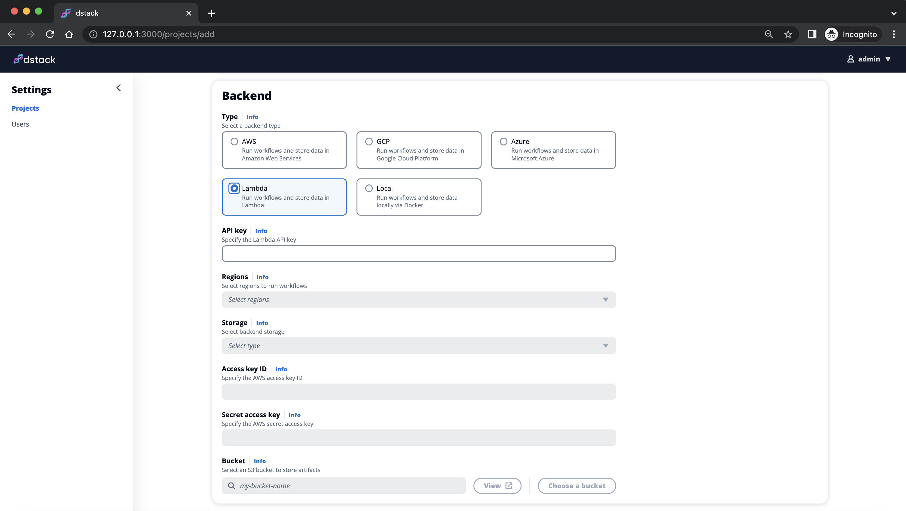

# Lambda Cloud GA, and Docker support

__The 0.10.5 release improves Lambda Cloud integration and adds support for Docker.__

In the previous update, we added initial integration with <a href="https://lambdalabs.com" target="_blank">Lambda Cloud</a>. With today's release, this integration has
significantly improved and finally goes generally available. Additionally, the latest release adds support for
custom Docker images.

<!-- more -->

## Lambda Cloud

In this update, we've added a possibility to create Lambda Cloud projects via the user interface.

{ width=800 }

All you need to do is provide your Lambda Cloud API key, and specify an S3 bucket and AWS credentials 
for storing state and artifacts.

[Learn more →](../../docs/reference/backends/lambda.md){ .md-button .md-button--primary }

Once the project is configured, feel free to run dev environments and tasks in Lambda Cloud using the `dstack` CLI.

## Custom Docker images

By default, `dstack` uses its own base [Docker images](https://hub.docker.com/r/dstackai/miniforge/tags) to run 
dev environments and tasks. These base images come pre-configured with Python, Conda, and essential CUDA drivers. 
However, there may be times when you need additional
dependencies that you don't want to install every time you run your dev environment or task.

To address this, `dstack` now allows specifying custom Docker images. Here's an example:

<div editor-title=".dstack.yml">

```yaml
type: task

image: ghcr.io/huggingface/text-generation-inference:0.9

env:
  - MODEL_ID=tiiuae/falcon-7b

ports:
 - 3000

commands: 
  - text-generation-launcher --hostname 0.0.0.0 --port 3000 --trust-remote-code
```

</div>

??? info "Existing limitations"

    Dev environments require the Docker image to have `openssh-server` pre-installed. If you want to use a custom Docker
    image with a dev environment and it does not include `openssh-server`, you can install it using the following 
    method:

    ```yaml
    type: dev-environment
    
    image: ghcr.io/huggingface/text-generation-inference:0.9
    
    build:
      - apt-get update
      - DEBIAN_FRONTEND=noninteractive apt-get install -y openssh-server
      - rm -rf /var/lib/apt/lists/*
 
    ide: vscode
    ```

The [documentation](../../docs/index.md) and [examples](https://github.com/dstackai/dstack-examples/blob/main/README.md)
are updated to reflect the changes in the release.

## Give it a try

Getting started with `dstack` takes less than a minute. Go ahead and give it a try.

<div class="termy">

```shell
$ pip install "dstack[aws,gcp,azure,lambda]" -U
$ dstack start
```

</div>
