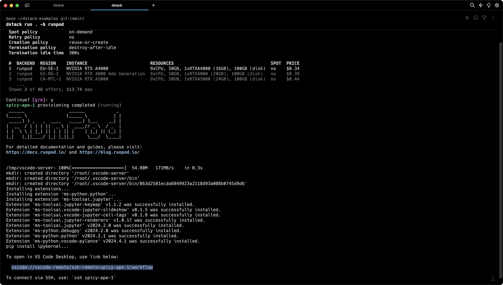
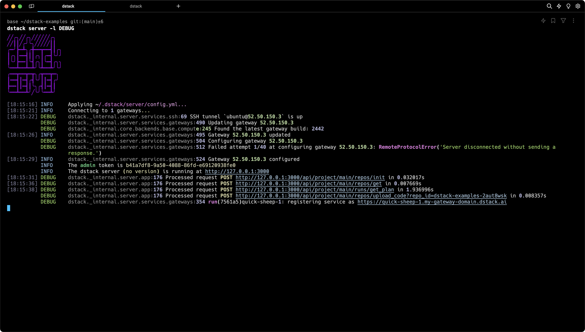

# dstack 0.18.0: RunPod integration, multi-node tasks, and more

The latest update adds RunPod integration, previews multi-node tasks for AWS, GCP, and Azure, and includes other improvements.

<!-- more -->

## RunPod integration

The update adds the long-awaited integration with RunPod, a distributed GPU cloud that offers GPUs at affordable prices.

To use RunPod, specify your RunPod API key in `~/.dstack/server/config.yml`:

```yaml
projects:
- name: main
  backends:
  - type: runpod
    creds:
      type: api_key
      api_key: US9XTPDIV8AR42MMINY8TCKRB8S4E7LNRQ6CAUQ9
```

Once the server is restarted, go ahead and run workloads:

{ width=800 }

!!! warning "NOTE:"
    If you're using a custom Docker image, its entrypoint cannot be anything other than `/bin/bash` or `/bin/sh`. 
    See the [issue](https://github.com/dstackai/dstack/issues/1137) for more details.

!!! info "NOTE:"
    The `runpod` backend supports on-demand instances only. Spot instance support coming soon.

## Multi-node tasks

Another major change with the update is the ability to run multi-node tasks over an interconnected cluster of instances.

Simply specify the `nodes` property for your task (to the number of required nodes) and run it.

```yaml
type: task

nodes: 2

commands:
  - git clone https://github.com/r4victor/pytorch-distributed-resnet.git
  - cd pytorch-distributed-resnet
  - mkdir -p data
  - cd data
  - wget -c --quiet https://www.cs.toronto.edu/~kriz/cifar-10-python.tar.gz
  - tar -xvzf cifar-10-python.tar.gz
  - cd ..
  - pip3 install -r requirements.txt torch
  - mkdir -p saved_models
  - torchrun --nproc_per_node=$DSTACK_GPUS_PER_NODE 
     --node_rank=$DSTACK_NODE_RANK 
     --nnodes=$DSTACK_NODES_NUM
     --master_addr=$DSTACK_MASTER_NODE_IP
     --master_port=8008 resnet_ddp.py 
     --num_epochs 20

resources:
  gpu: 1
```

Currently supported providers for this feature include AWS, GCP, and Azure. For other providers or on-premises servers, file the corresponding feature requests or ping on Discord.

## Optional commands

One more small improvement is that the commands property is now not required for tasks and services if you use an image that has a default entrypoint configured.

```yaml
type: task

image: r8.im/bytedance/sdxl-lightning-4step

ports:
  - 5000

resources:
  gpu: 24GB
```

## Server output

The update also improves the output of the `dstack server` command:

{ width=800 }

## GCP permissions

Last but not least, we've made the permissions required for using `dstack` with GCP more granular.

```shell
compute.disks.create
compute.firewalls.create
compute.images.useReadOnly
compute.instances.create
compute.instances.delete
compute.instances.get
compute.instances.setLabels
compute.instances.setMetadata
compute.instances.setTags
compute.networks.updatePolicy
compute.regions.list
compute.subnetworks.use
compute.subnetworks.useExternalIp
compute.zoneOperations.get
```

## Feedback

You're welcome to give the new release a try and share your feedback. If you encounter any bugs, report them directly
via [issues](https://github.com/dstackai/dstack/issues), or on [our Discord](https://discord.gg/u8SmfwPpMd).