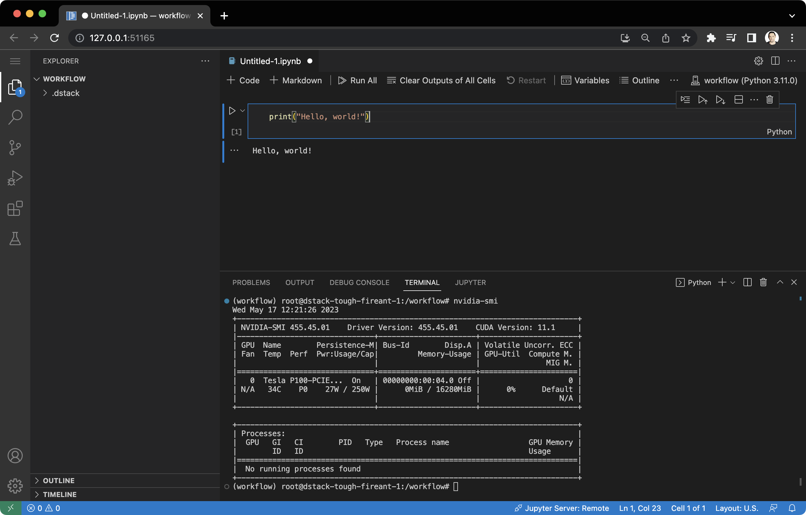

# Dev environments

A dev environment is a virtual machine that includes the environment and an interactive IDE or notebook setup
based on a pre-defined configuration.

With `dstack`, you can define such configurations as code and launch your dev environments with a single command, 
either locally or in any cloud.

[//]: # (TODO [TASK]: Add a link to the Playground)

## Creating a configuration file

A configuration can be defined as a YAML file (under the `.dstack/workflows` directory).

<div editor-title=".dstack/workflows/dev-environments.yaml"> 

```yaml
workflows:
  - name: code-gpu
    provider: code
    setup:
      - pip install -r dev-environments/requirements.txt
    resources:
      gpu:
        count: 1
```

</div>

The [configuration](../reference/providers/code.md) 
allows you to customize hardware resources, set up the Python environment, expose ports, configure cache, and more.

[//]: # (TODO [MAJOR]: It doesn't allow to conveniently load and save artifacts)

[//]: # (TODO [MEDIUM]: It doesn't explain how to mount deps)

## Running a dev environment

Once a configuration is defined, you can run it using the [`dstack run`](../reference/cli/run.md) command:

<div class="termy">

```shell
$ dstack run code-gpu

RUN      WORKFLOW  SUBMITTED  STATUS     TAG
shady-1  code-gpu   now        Submitted  
 
Starting SSH tunnel...

To exit, press Ctrl+C.

Web UI available at http://127.0.0.1:10000/?tkn=4d9cc05958094ed2996b6832f899fda1
```

</div>

If we click the URL, it will open the dev environment.

{ width=800 }

For convenience, `dstack` uses an exact copy of the source code that is locally present in the folder where you use the `dstack` command.

??? info "Using .gitignore"
    If you don't want the dev environment to sync certain files (especially large local files that are not needed
    for the dev environment), feel free to add them to the `.gitignore` file. In this case, `dstack` will ignore them,
    even if you aren't using Git.

If you configure a project to run dev environments in the cloud, `dstack` will automatically provision the
required cloud resources, and forward ports of the dev environment to your local machine.

??? info "Projects"
    The default project runs dev environments locally. However, you can
    log into Hub and configure additional projects to run dev environments in a cloud account of your choice. 

    [Learn more →](guides/projects){ .md-button .md-button--primary }

[//]: # (TODO [TASK]: Add a link to the Projects guide for more details)

[//]: # (TODO [TASK]: Add links to the CLI reference for the commands and their options)

#### Stopping a dev environment 

To stop the dev environment, click `Ctrl`+`C` while the [`dstack run`](../reference/cli/run.md) command is running,
or use the [`dstack stop`](../reference/cli/stop.md) command. `dstack` will automatically clean up any cloud resources if they are used.

## Supported IDEs

Out of the box, `dstack` allows you to launch VS Code, JupyterLab, and Jupyter notebooks.
All you have to do is to set the [`provider`](../reference/providers/bash.md) property in the YAML configuration accordingly:

- [`code`](../reference/providers/code.md) – VS Code
- [`lab`](../reference/providers/lab.md) - JupyterLab
- [`notebook`](../reference/providers/notebook.md) – Jupyter notebook

[//]: # (TODO [TASK]: Use content tabs to show multiple examples - requires fixing CSS styles)

#### Connecting via SSH

Alternatively, you can use the [`bash`](../reference/providers/bash.md) provider with the 
[`ssh`](../reference/providers/bash.md) property set to `true` to attach any desktop IDE to the dev
environment via SSH.

<div editor-title=".dstack/workflows/dev-environments.yaml"> 

```yaml
  workflows:
  - name: ssh
    provider: bash
    ssh: true 
    commands:
      - tail -f /dev/null
```

</div>

[//]: # (TODO [MEDIUM]: Currently, you have to use bash and tail)

[//]: # (TODO [MEDIUM]: Currently, it doesn't create an alias in `~/.ssh/config` automatically)

[//]: # (TODO [TASK]: Show the output)

[//]: # (TODO [MAJOR]: Currently, it doesn't support PyCharm)

## Configuring resources

If your project is configured to run dev environments in the cloud, you can use the 
[`resources`](../reference/providers/code.md#resources) property in the YAML 
file to request hardware resources like memory, GPUs, and shared memory size. 

<div editor-title=".dstack/workflows/dev-environments.yaml"> 

```yaml
workflows:
  - name: code-v100-spot
    provider: code
    resources:
      gpu:
        name: V100
        count: 8
      interruptible: true
```

</div>

!!! info "NOTE:"
    The [`interruptible`](../reference/providers/code.md#resources) property instructs `dstack` to use spot instances, which may not always be available. However, when they
    are, they are significantly cheaper.

[//]: # (TODO [MAJOR]: Currently, it doesn't allow you to specify interruptible behaviour, e.g. "spot or fail" or "spot or on-demand")

## Setting up the environment

You can use the [`setup`](../reference/providers/code.md) property in the YAML file to pre-install packages or run other bash commands during environment
startup.

<div editor-title=".dstack/workflows/dev-environments.yaml"> 

```yaml
workflows:
  - name: code-conda
    provider: code
    python: 3.11
    setup:
      - conda env create -f environment.yml
```

</div>

[//]: # (TODO [MEDIUM]: Currently, it's hard to cache Conda environments)

[//]: # (TODO [MINOR]: Currently, there's no way to set up the bash profile, e.g. to activate the environment)

The [`python`](../reference/providers/code.md) property specifies the version of Python. If not specified, `dstack` uses
your current version.

You can use `pip` and `conda` executables to install packages and set up the environment.

!!! info "NOTE:"
    Refer to [Configuring cache](#configuring-cache) to speed up the setup process. 

[//]: # (TODO [MINOR]: Make sure conda is configured not to ask for confirmation)

[//]: # (TODO [MAJOR]: Currently, packages has to be installed on every run)

[//]: # (TODO [MAJOR]: Currently, there is no way to use your own Docker image)

## Exposing ports

If you intend to run web apps from the dev environment, specify the list of ports using the
[`ports`](../reference/providers/code.md#ports) property.

[//]: # (TODO [TASK]: Requires an example, including the YAML and the output)

`dstack` will automatically forward these ports to your local machine. You'll see the URLs to access each port in the
output.

[//]: # (TODO [MEDIUM]: It would be easier if dstack forwarded ports automatically)

[//]: # (TODO [MAJOR]: Currently, it doesn't allow to hot reload changes)

[//]: # (TODO [MAJOR]: Currently, it requires the user to hardcode `--host 0.0.0.0`)

## Configuring cache

To avoid downloading files (e.g. pre-trained models, external data, or Python packages) every time you restart your dev
environment, you can selectively cache the desired paths between runs.

<div editor-title=".dstack/workflows/dev-environments.yaml"> 

```yaml
workflows:
  - name: code-cached
    provider: code
    cache:
      - path: ~/.cache/pip
      - path: ./data
      - path: ./models
```

</div>

!!! info "NOTE:"
    Caching enhances performance and helps you avoid unnecessary data transfer costs. 

#### Cleaning up the cache

To clean up the cache, you can delete the files directly from the dev environment or use the 
[`dstack prune cache`](../reference/cli/prune.md)
CLI command, followed by the name of the configuration.

[//]: # (TODO [MAJOR]: Cache is not the same as persistent storage)

[//]: # (TODO [TASK]: Elaborate on the main benefits of using dstack for dev environments)

!!! info "NOTE:"
    Check out the [`dstackai/dstack-examples`](https://github.com/dstackai/dstack-examples/blob/main/README.md) repo for source code and other examples.

[//]: # (TODO [TASK]: Mention secrets)