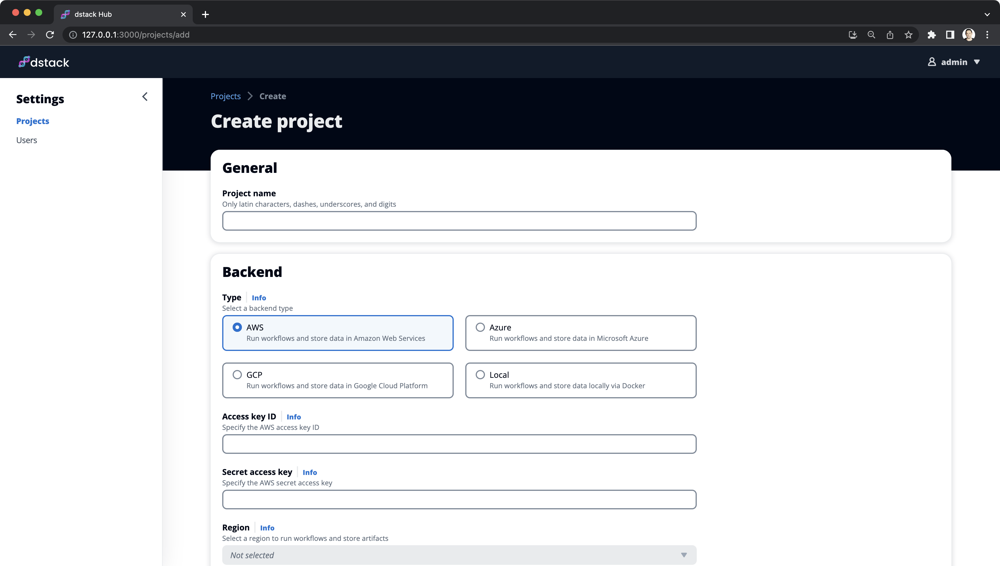
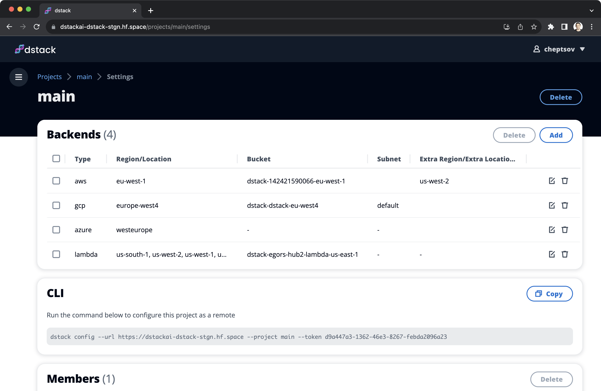

# Projects

A project allows you to configure where to run dev environments, pipelines, and apps, as well as manage users that 
access it.

At startup, `dstack` sets up a default project for local execution. To run dev environments, pipelines, and apps in your
desired cloud account (AWS, GCP, Azure, etc), you must create the corresponding project and configure the `dstack` CLI to use it.

!!! info "NOTE:"
    You can configure multiple projects and switch between them using the `dstack` CLI.

## Creating projects

To create a new project, log in to the Hub application, open the `Projects` page, and click the `Add` button.

{ width=800 }

Then, you need to select the type of backend where you want to provision infrastructure and store data, and provide the corresponding backend settings.
For instructions specific to a particular cloud, please refer to the relevant sections below.

??? info "AWS"
    To use AWS, you will require an S3 bucket for storing state and artifacts, as well as credentials to access the 
    corresponding cloud services.

    [Learn more →](../../reference/backends/aws){ .md-button .md-button--primary }

??? info "GCP"
    To use GCP, you will require a cloud bucket for storing state and artifacts, as well as a
    service account to access the corresponding cloud services.

    [Learn more →](../../reference/backends/gcp){ .md-button .md-button--primary }

## Configuring the CLI

Once you have created the project, you will find the `CLI` code snippet in its `Settings`. 

{ width=800 }

Execute this code in the terminal to configure the project with the CLI.

<div class="termy">

```shell
$ dstack config --url http://localhost:3000 --project aws --token 34ccc68b-8579-44ff-8923-026619ddb20d
```

</div>

To use this project with the CLI, you need to pass its name using the `--project` argument in CLI commands (such as
`dstack run`, `dstack init`, etc).

!!! info "NOTE:"
    If you want to set the project as the default, add the `--default` flag to the `dstack config` command.

[//]: # (TODO [TASK]: Mention where the configuration is stored (i.e. `~/.dstack/config.yaml`)

[//]: # (TODO [MEDIUM]: Currently, there is no settings, such as quota management, max duration, etc.)