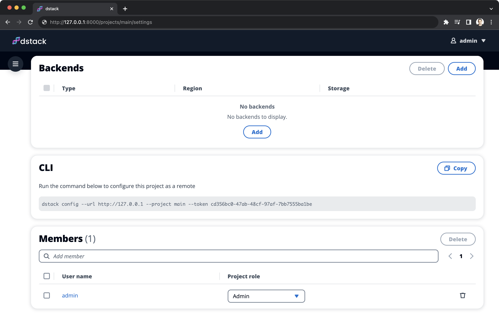

# Quickstart

`dstack` is an open-source tool that enables the execution of LLM workloads across multiple cloud GPU providers, ensuring
optimal GPU pricing and availability.

## Installation

To use `dstack`, install it with `pip`, and start the server.

<div class="termy">

```shell
$ pip install "dstack[aws,gcp,azure,lambda]"
$ dstack start

The server is available at http://127.0.0.1:3000?token=b934d226-e24a-4eab-eb92b353b10f
```

</div>

## Configure backends

Upon startup, the server sets up the default project called `main`.

{ width=800 }

Prior to using `dstack`, open the `main` project's settings, and add cloud backends 
(e.g., [AWS](reference/backends/aws.md), [GCP](reference/backends/gcp.md), [Azure](reference/backends/azure.md), [Lambda](reference/backends/lambda.md), etc.).

[//]: # (Once cloud backends are configured, `dstack` will be able to provision cloud resources across configured clouds, ensuring)
[//]: # (the best price and higher availability.)

## Initialize the repo

To use `dstack` for your project, make sure to first run the [`dstack init`](reference/cli/init.md) command in the root folder of the project.

<div class="termy">

```shell
$ mkdir quickstart && cd quickstart
$ dstack init
```

</div>

## Define a configuration

A configuration is a YAML file that describes what you want to run with `dstack`. Configurations can be of three
types: `dev-environment`, `task`, and `service`.

### Dev environments

A dev environment is a virtual machine pre-configured an IDE.

<div editor-title=".dstack.yml"> 

```yaml
type: dev-environment

python: "3.11" # (Optional) If not specified, your local version is used

setup: # (Optional) Executed once at the first startup
  - pip install -r requirements.txt

ide: vscode
```

</div>

Once it's live, you can open it in your local VS Code by clicking the provided URL in the output.

### Tasks

A task can be any script that you may want to run on demand: a batch job, or a web application.

<div editor-title="serve.dstack.yml"> 

```yaml
type: task

python: "3.11" # (Optional) If not specified, your local version is used

ports:
  - 7860

commands:
  - pip install -r requirements.txt
  - python app.py
```

</div>

While the task runs in the cloud, the CLI forwards traffic, allowing you to access the application from your local
machine. 

### Services

A service is an application that is accessible through a public endpoint.

<div editor-title="deploy.dstack.yml"> 

```yaml
type: service

python: "3.11" # (Optional) If not specified, your local version is used

gateway: ${{ secrets.GATEWAY_ADDRESS }}

port: 7860

commands:
  - pip install -r requirements.txt
  - python app.py
```

</div>

Once the service is up, `dstack` makes it accessible from the Internet through
the [gateway](guides/services.md#configure-a-gateway-address).

[//]: # (!!! info "Configuration filename")
[//]: # (    The configuration file must be named with the suffix `.dstack.yml`. For example,)
[//]: # (    you can name the configuration file `.dstack.yml` or `serve.dstack.yml`. You can define)
[//]: # (    these configurations anywhere within your project. )
[//]: # (    )
[//]: # (    Each folder may have one default configuration file named `.dstack.yml`.)

For more details on the syntax of configuration file, refer to the [`.dstack.yml` Reference](../docs/reference/dstack.yml/index.md).

## Run the configuration

### Default configurations

To run a configuration, you have to call the [`dstack run`](reference/cli/run.md) command and pass the path to the 
directory which you want to use as a working directory when running the configuration.

<div class="termy">

```shell
$ dstack run . 

 RUN          CONFIGURATION  BACKEND  RESOURCES        SPOT  PRICE
 fast-moth-1  .dstack.yml    aws      5xCPUs, 15987MB  yes   $0.0547


Provisioning and starting SSH tunnel...
---> 100%

To open in VS Code Desktop, use this link:
  vscode://vscode-remote/ssh-remote+fast-moth-1/workflow
```

</div>

If you've not specified a specific configuration file, `dstack` will use the default configuration
defined in the given directory (named `.dstack.yml`).

### Non-default configurations

If you want to run a non-default configuration, you have to specify the path to the configuration
using the `-f` argument:

<div class="termy">

```shell
$ dstack run . -f serve.dstack.yml

 RUN             CONFIGURATION     BACKEND  RESOURCES        SPOT  PRICE
 old-lionfish-1  serve.dstack.yml  aws      5xCPUs, 15987MB  yes   $0.0547

Provisioning and starting SSH tunnel...
---> 100%

Launching in *reload mode* on: http://127.0.0.1:7860 (Press CTRL+C to quit)
```

</div>

[//]: # (!!! info "Port forwarding")
[//]: # (    By default, `dstack` forwards the ports used by dev environments and tasks to your local machine for convenient access.)

For more details on how the `dstack run` command works, refer to the [CLI Reference](reference/cli/run.md).

[//]: # (TODO: Not sure if port forwarding is worth mentioning)
[//]: # (TODO: Mention resource configuration and/or profiles)
[//]: # (TODO: Move .gitignore to the `dstack run`'s reference page)

[//]: # (## Profiles)
[//]: # ()
[//]: # (If you have [configured]&#40;projects.md&#41; a project that runs dev environments and tasks in the cloud, you can define multiple)
[//]: # (profiles. Each profile can configure the project to use and the resources required for the run.)
[//]: # ()
[//]: # (To define profiles, create the `profiles.yml` file in the `.dstack` folder within your project directory. Here's an example:)
[//]: # ()
[//]: # (<div editor-title=".dstack/profiles.yml"> )
[//]: # ()
[//]: # (```yaml)
[//]: # (profiles:)
[//]: # (  - name: gcp-t4)
[//]: # (    project: gcp)
[//]: # (    )
[//]: # (    resources:)
[//]: # (      memory: 24GB)
[//]: # (      gpu:)
[//]: # (        name: T4)
[//]: # (        )
[//]: # (    spot_policy: auto)
[//]: # (    retry_policy:)
[//]: # (      limit: 30min)
[//]: # (    max_duration: 1d)
[//]: # (      )
[//]: # (    default: true)
[//]: # (```)
[//]: # ()
[//]: # (</div>)

[//]: # (!!! info "Spot instances")
[//]: # (    If `spot_policy` is set to `auto`, `dstack` prioritizes spot instances.)
[//]: # (    If these are unavailable, it uses `on-demand` instances. To cut costs, set `spot_policy` to `spot`.)
[//]: # (    )
[//]: # (    If `dstack` can't find capacity, an error displays. To enable continuous capacity search, use `retry_policy` with a )
[//]: # (    `limit`. For example, setting it to `30min` makes `dstack` search for capacity for 30 minutes.)
[//]: # ()
[//]: # (    Note that spot instances are significantly cheaper but can be interrupted. Your code should ideally )
[//]: # (    handle interruptions and resume work from saved checkpoints.)
[//]: # ()
[//]: # (Now, if you use the `dstack run` command, `dstack` will use the default profile.)
[//]: # ()
[//]: # (!!! info "Multiple profiles")
[//]: # (    You can define multiple profiles according to your needs and use any of them with the `dstack run` command by specifying)
[//]: # (    the desired profile using the `--profile` argument.)
[//]: # ()
[//]: # (For more details on the syntax of the `profiles.yml` file, refer to the [Reference]&#40;reference/profiles.yml.md&#41;.)