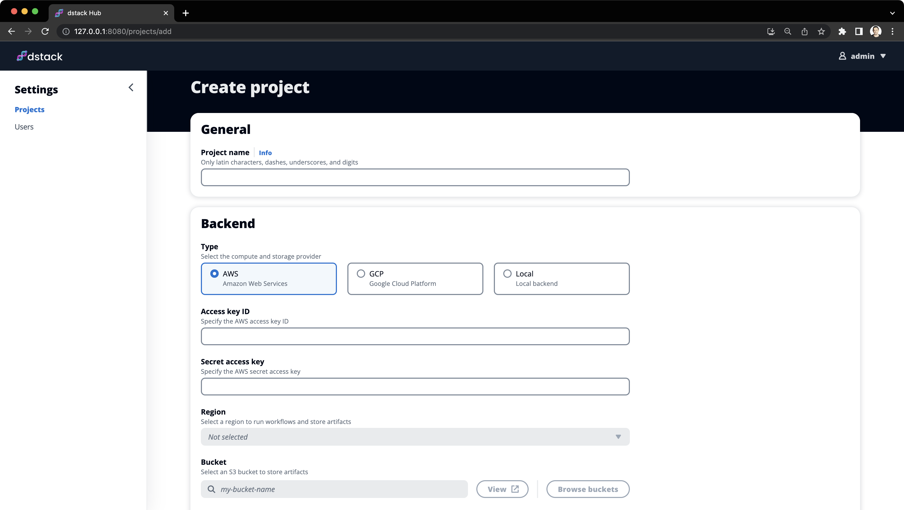

# Quick start

`dstack` helps create on-demand dev environments, and run ML workflows cost-effectively on any cloud.

## Installation and setup

To use `dstack`, install it with `pip` and start the Hub server.

<div class="termy">

```shell
$ pip install dstack
$ dstack start

The hub is available at http://127.0.0.1:3000?token=b934d226-e24a-4eab-eb92b353b10f
```

</div>

!!! info "NOTE:"
    On startup, Hub configures the default project to run dev environments and workflows locally.

    You can log into Hub and configure other projects that will run dev environments and
    workflows in your cloud account (AWS, GCP, etc.).

## Create your first repo

A repo is any folder from which you want to run dev environments and workflows.

To initialize a folder as a repo, you have to run the `dstack init` command there.

<div class="termy">

```shell
$ mkdir hello-dstack && cd hello-dstack
$ dstack init
```

</div>

## Create your first dev environment

To create a dev environment, all you have to do is define it via YAML (under the `.dstack/workflows` folder) 
and then run it by name via the CLI.

<div editor-title=".dstack/workflows/hello-env.yaml"> 

```yaml
workflows:
  - name: hello-env
    provider: code
    python: 3.10
    setup:
      - pip install transformers accelerate gradio
    resources:
      gpu:
        name: V100
        count: 1
```

</div>

!!! info "NOTE:"
    The YAML file allows you to configure hardware resources, set up the Python environment, pre-install packages,
    expose ports, and many more.

[//]: # (TODO: Currently, it's limited to the built-in VS Code, doesn't forward ports automatically, doesn't provide persistence of the storage, pre-installs packages on every run, and has other limitations)

Now, you can launch the dev environment at any time using the `dstack run` command:

<div class="termy">

```shell
$ dstack run hello-env

RUN      WORKFLOW   SUBMITTED  STATUS     TAG
shady-1  hello-env  now        Submitted  
 
Starting SSH tunnel...

To exit, press Ctrl+C.

Web UI available at http://127.0.0.1:51845/?tkn=4d9cc05958094ed2996b6832f899fda1
```

</div>

`dstack` will launch the dev environment based on the configuration and fetch there an exact copy of the source code
that was locally present in the folder where you ran the `dstack` command.

[//]: # (TODO: A screenshot)

!!! info "NOTE:"
    If you configured a project to run dev environments in the cloud, `dstack` will provision the
    required resources and forward ports to your local machine. When you stop the dev environment, `dstack` will
    clean up the cloud resources automatically.

## Run your first workflow

A workflow is any task that you may want to run based on a pre-defined configuration. This task may involve 
processing data, training or fine-tuning a model, batch inference, etc.

[//]: # (TODO: Need to elaborate why this must be a workflow)

To run a workflow, all you have to do is define it via YAML (under the `.dstack/workflows` folder) 
and then run it by name via the CLI.

<div editor-title=".dstack/workflows/hello.yaml"> 

```yaml
workflows:
  - name: hello
    provider: bash
    commands:
      - echo "Hello, world!"       
```

</div>

!!! info "NOTE:"
    The YAML file allows you to configure hardware resources and output artifacts, set up the Python environment, 
    expose ports, and many more.

[//]: # (TODO: Currently, it's limited to YAML)

Now, you can launch the workflow at any time using the `dstack run` command:

<div class="termy">

```shell
$ dstack run hello

RUN      WORKFLOW  SUBMITTED  STATUS     TAG
shady-1  hello     now        Submitted  
 
Provisioning... It may take up to a min.

To exit, press Ctrl+C.

Hello, world!
```

</div>

When running, the workflow will use the exact copy of the source code that was locally present in the folder where you ran
the `dstack` command.

!!! info "NOTE:"
    If you configured a project to run workflows in the cloud, the `dstack run` command will provision the required resources.
    After the workflow is finished, `dstack` will automatically save output artifacts and clean up the cloud resources.

## Create projects

To run dev environments and workflows in the cloud and have the cloud resources automatically provisioned and
cleaned up, log in to the Hub and create a corresponding project.

{ width="750" }

Then, configure the project with the CLI.

<div class="termy">

```shell
$ dstack config --url http://127.0.0.1:3000 \
  --project my-awesome-project \
  --token b934d226-e24a-4eab-a284-eb92b353b10f
```

</div>

!!! info "NOTE:"
    With the CLI, you can configure multiple projects and pass the project name to the CLI by using the `--project` argument.

[//]: # (TODO: Currently, Hub doesn't monitor usage)

[//]: # (TODO: Elaborate on the main benefits of using dstack)