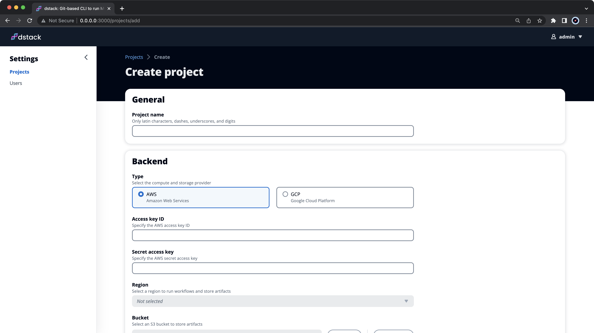

# Quick start

[//]: # (!!! info "NOTE:")
[//]: # (    The source code of this example is available in the <a href="https://github.com/dstackai/dstack-playground#readme" target="__blank">Playground</a>. )

## Install the CLI

Use `pip` to install `dstack`:

<div class="termy">

```shell
$ pip install dstack
```

</div>

## Create a repo

To use `dstack`, you need at least one remote branch configured in your project hosted on any platform like GitHub,
GitLab, or BitBucket.

??? info "Set up a remote branch"
    If you haven't set up a remote branch in your repo yet, here's how you can do it:

    <div class="termy">
    
    ```shell
    $ echo "# Quick start" >> README.md
    $ git init
    $ git add README.md
    $ git commit -m "first commit"
    $ git branch -M main
    $ git remote add origin "<your remote repo URL>"
    $ git push -u origin main
    ```

    </div>

Then, you need to initialize the repo.

<div class="termy">

```shell
$ dstack init
```

</div>

### Create a script

Let's create the following training script.

<div editor-title="examples/mnist/train_mnist.py"> 

```python
import torch
from pytorch_lightning import LightningModule, Trainer
from pytorch_lightning.callbacks.progress import TQDMProgressBar
from torch.nn import functional as F
from torch.utils.data import DataLoader
from torchvision import transforms
from torchvision.datasets import MNIST


class MNISTModel(LightningModule):
    def __init__(self):
        super().__init__()
        self.l1 = torch.nn.Linear(28 * 28, 10)

    def forward(self, x):
        return torch.relu(self.l1(x.view(x.size(0), -1)))

    def training_step(self, batch, batch_nb):
        x, y = batch
        loss = F.cross_entropy(self(x), y)
        return loss

    def configure_optimizers(self):
        return torch.optim.Adam(self.parameters(), lr=0.02)


BATCH_SIZE = torch.cuda.device_count() * 64 if torch.cuda.is_available() else 64

if __name__ == "__main__":
    # Init our model
    mnist_model = MNISTModel()

    # Init DataLoader from MNIST Dataset
    train_ds = MNIST("./data", train=True, download=True, transform=transforms.ToTensor())
    train_loader = DataLoader(train_ds, batch_size=BATCH_SIZE)

    # Initialize a trainer
    trainer = Trainer(
        accelerator="auto",
        devices="auto",
        max_epochs=3,
        callbacks=[TQDMProgressBar(refresh_rate=20)],
    )

    # Train the model ⚡
    trainer.fit(mnist_model, train_loader)
```

</div>

### Define a workflow

Define the corresponding workflow as a YAML file in the `.dstack/workflows` folder within the repo to run it
via `dstack`.

<div editor-title=".dstack/workflows/mnist.yaml"> 

```yaml
workflows:
  - name: train-mnist
    provider: bash
    commands:
      - pip install torchvision pytorch-lightning tensorboard
      - python examples/mnist/train_mnist.py
    artifacts:
      - path: ./lightning_logs
```

</div>

The workflow instructs `dstack` how to execute it, which folders to save as artifacts for later use, which folders to cache between
runs, the dependencies it has on other workflows, the ports to open, and so on.

!!! info "NOTE:"
    `dstack` uses your local Python version by default to run workflows, but you can override it
    in [YAML](reference/providers/bash.md).

## Run locally

Note, before you can run the workflow, make sure the local changes are staged in Git.

??? info "Stage the local changes"
    
    You can stage all local changes by running this command:
    
    <div class="termy">
    
    ```shell
    $ git add -A
    ```
    
    </div>

<div class="termy">

```shell
$ dstack run train-mnist

RUN      WORKFLOW     SUBMITTED  STATUS     TAG  BACKEND
zebra-1  train-mnist  now        Submitted       local

Provisioning... It may take up to a minute. ✓

To interrupt, press Ctrl+C.

GPU available: False, used: False

Epoch 1: [00:03<00:00, 280.17it/s, loss=1.35, v_num=0]
---> 100%
```

</div>

!!! info "NOTE:"
    To run workflows locally, you need to have either Docker or [NVIDIA Docker](https://github.com/NVIDIA/nvidia-docker) 
    installed on your machine.

## Configure the Hub

To run workflows remotely in a configured cloud, you will need the Hub application, which can be installed either on a
dedicated server for team work or directly on your local machine.

### Start the Hub application

To start the Hub application, use this command:

<div class="termy">

```shell
$ dstack hub start

The hub is available at http://127.0.0.1:3000?token=b934d226-e24a-4eab-a284-eb92b353b10f
```

</div>

To login as an administrator, visit the URL in the output.

### Create a project

Go ahead and create a new project.

{ width=800 }

Choose a backend type (such as AWS or GCP), provide cloud credentials, and specify settings like
artifact storage bucket and the region where to run workflows.

{ width=800 }

### Configure the CLI

Copy the CLI command from the project settings and execute it in your terminal to configure the project as a remote.

<div class="termy">

```shell
$ dstack config hub --url http://127.0.0.1:3000 \
  --project my-awesome-project \
  --token b934d226-e24a-4eab-a284-eb92b353b10f
```

</div>

Now, you can run workflows remotely in the created project.

## Run remotely

To run a workflow remotely, use the `--remote` flag with `dstack run` and
request hardware [`resources`](usage/resources.md) (like GPU, memory, interruptible instances, etc.) that you need.

<div class="termy">

```shell
$ dstack run train-mnist --remote --gpu 1

RUN       WORKFLOW     SUBMITTED  STATUS     TAG  BACKEND
turtle-1  train-mnist  now        Submitted       aws

Provisioning... It may take up to a minute. ✓

To interrupt, press Ctrl+C.

GPU available: True, used: True

Epoch 1: [00:03<00:00, 280.17it/s, loss=1.35, v_num=0]
---> 100%
```

</div>

The command will automatically provision the required cloud resources in the corresponding cloud upon workflow 
startup and tear them down upon completion.

!!! info "NOTE:"
    As long as the Hub application is running, you don't have to worry about tearing down the cloud resources. 
    Hub will take care of it automatically.