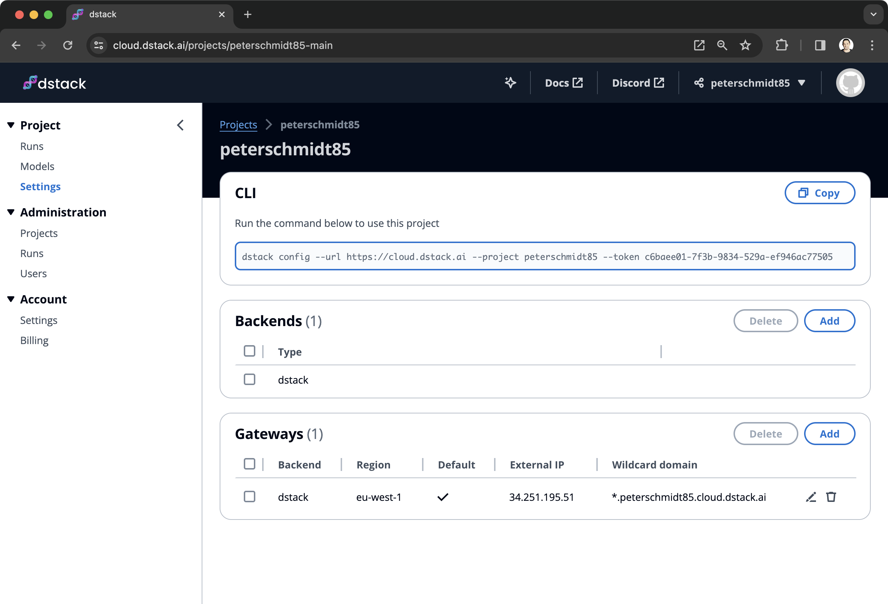

# Quickstart

??? info "Set up the CLI"
    To use the open-source version, make sure to [install the server](installation/index.md) and configure backends.

    If you're using [dstack Sky](https://sky.dstack.ai), install the CLI and run the `dstack config` command:
    
    { width=800 }

    Once the CLI is set up, follow the quickstart.

## Initialize a repo

To use `dstack`'s CLI in a folder, first run [`dstack init`](reference/cli/index.md#dstack-init) within that folder.

<div class="termy">

```shell
$ mkdir quickstart && cd quickstart
$ dstack init
```

</div>

Your folder can be a regular local folder or a Git repo.

## Define a configuration

Define what you want to run as a YAML file. The filename must end with `.dstack.yml` (e.g., `.dstack.yml`
or `train.dstack.yml` are both acceptable).

=== "Dev environment"

    Dev environments allow you to quickly provision a machine with a pre-configured environment, resources, IDE, code, etc.

    <div editor-title=".dstack.yml"> 

    ```yaml
    type: dev-environment

    # Use either `python` or `image` to configure environment
    python: "3.11"
    # image: ghcr.io/huggingface/text-generation-inference:latest
    
    ide: vscode

    # (Optional) Configure `gpu`, `memory`, `disk`, etc
    resources:
      gpu: 80GB
    ```

    </div>

=== "Task"

    Tasks make it very easy to run any scripts, be it for training, data processing, or web apps. They allow you to pre-configure the environment, resources, code, etc.

    <div editor-title="train.dstack.yml"> 

    ```yaml
    type: task

    python: "3.11"
    env:
      - HF_HUB_ENABLE_HF_TRANSFER=1
    commands:
      - pip install -r fine-tuning/qlora/requirements.txt
      - python fine-tuning/qlora/train.py

    # (Optional) Configure `gpu`, `memory`, `disk`, etc
    resources:
      gpu: 80GB
    ```

    </div>

    Ensure `requirements.txt` and `train.py` are in your folder. You can take them from [`dstack-examples`](https://github.com/dstackai/dstack-examples/tree/main/fine-tuning/qlora).

=== "Service"

    Services make it easy to deploy models and apps cost-effectively as public endpoints, allowing you to use any frameworks.

    <div editor-title="serve.dstack.yml"> 

    ```yaml
    type: service

    image: ghcr.io/huggingface/text-generation-inference:latest
    env:
      - MODEL_ID=mistralai/Mistral-7B-Instruct-v0.1
    port: 80
    commands:
      - text-generation-launcher --port 80 --trust-remote-code

    # (Optional) Configure `gpu`, `memory`, `disk`, etc
    resources:
      gpu: 80GB
    ```

    </div>

## Run configuration

Run a configuration using the [`dstack run`](reference/cli/index.md#dstack-run) command, followed by the working directory path (e.g., `.`), the path to the
configuration file, and run options (e.g., configuring hardware resources, spot policy, etc.)

<div class="termy">

```shell
$ dstack run . -f train.dstack.yml

 BACKEND     REGION         RESOURCES                     SPOT  PRICE
 tensordock  unitedkingdom  10xCPU, 80GB, 1xA100 (80GB)   no    $1.595
 azure       westus3        24xCPU, 220GB, 1xA100 (80GB)  no    $3.673
 azure       westus2        24xCPU, 220GB, 1xA100 (80GB)  no    $3.673
 
Continue? [y/n]: y

Provisioning...
---> 100%

Epoch 0:  100% 1719/1719 [00:18<00:00, 92.32it/s, loss=0.0981, acc=0.969]
Epoch 1:  100% 1719/1719 [00:18<00:00, 92.32it/s, loss=0.0981, acc=0.969]
Epoch 2:  100% 1719/1719 [00:18<00:00, 92.32it/s, loss=0.0981, acc=0.969]
```

</div>

The `dstack run` command automatically uploads your code, including any local uncommitted changes. 
To exclude any files from uploading, use `.gitignore`.

!!! info "What's next?"
    1. Read about [dev environments](concepts/dev-environments.md), [tasks](concepts/tasks.md), 
        [services](concepts/services.md), and [pools](concepts/pools.md) 
    2. Browse [examples](../examples/index.md)
    3. Join the [Discord server](https://discord.gg/u8SmfwPpMd)