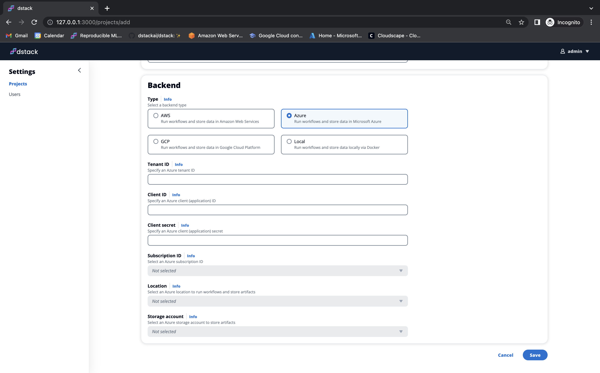

# Azure

The `Azure` backend type allows to provision infrastructure and store state and artifacts in
an Azure account.

Follow the step-by-step guide below to configure a project with this backend.

## 1. Create a resource group

First, create a new Azure resource group. All resource created by `dstack` will belong to this group.

## 2. Create a storage account

Next, create an Azure storage account in the newly created resource group. `dstack` will use this storage account to store metadata and artifacts.

!!! info "NOTE:"
    Make sure that the storage account is created in the same region where you plan to provision
    infrastructure.

## 3. Create an Azure Active Directory app 

`dstack` needs an Azure Active Directory app credentials to authenticate with your Azure account. If the app is `Owner` of the subscription, `dstack` will automatically set up all the resources required to run workflows. It will also create a separate managed identity with fine-grained permissions to authenticate with your Azure account when running workflows. 

To create new application credentials using the Azure CLI, run:

```
az ad sp create-for-rbac --name dstack-app --role Owner --scopes /subscriptions/$SUBSCRIPTION_ID --query "{ client_id: appId, client_secret: password, tenant_id: tenant }"
```

## 4. Create a project

Now that you have the credentials set up, log in to the Hub, open the `Projects` page, click `Add`, and select `Azure` in
the `Type` field.

{ width=800 }

It may take up to a minute to set up Azure resource after saving the project settings.

### Fields reference

The following fields are required:

- `Tenant ID` - (Required) The Azure Tenant ID
- `Client ID` - (Required) The Client ID to authenticate `dstack`
- `Client Secret` - (Required) The Client secret to authenticate `dstack`
- `Subscription ID` - (Required) The Azure Subscription ID
- `Location` - (Required) The region where `dstack` will create provision infrastructure and store state and artifacts
- `Storage account` - (Required) The Storage account to store state and artifacts (must be in the same region)

## 5. Configure the CLI

!!! info "NOTE:"
    Once you have created the project, feel free to use the CLI code snippet to configure it for use with the created project.

    [Learn more →](../../../guides/projects#configuring-the-cli){ .md-button .md-button--primary }
