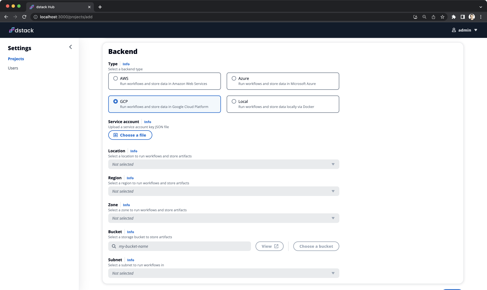

# GCP

The GCP backend type allows to provision infrastructure and store state and artifacts in a GCP account.

Follow the step-by-step guide below to configure a project with this backend.

## 1. Enable APIs

First, ensure that the required APIs are [enabled](https://cloud.google.com/endpoints/docs/openapi/enable-api) in your GCP project.

??? info "Required APIs"
    Here's the list of APIs that have to be enabled for the project.

    ```
    cloudapis.googleapis.com
    compute.googleapis.com 
    logging.googleapis.com
    secretmanager.googleapis.com
    storage-api.googleapis.com
    storage-component.googleapis.com 
    storage.googleapis.com 
    ```

## 2. Create a storage bucket

Once the APIs are enabled, proceed and create a storage bucket. `dstack` will use this bucket to store state and
artifacts.

!!! info "NOTE:"
    Make sure that the bucket is created in the same region where you plan to provision
    infrastructure.

## 3. Set up GCP credentials

`dstack` support two methods to authenticate with GCP: Default credentials and Service account key.

### Default credentials

`dstack` can automatically pick up [GCP default credentials](https://cloud.google.com/docs/authentication/application-default-credentials)
set up on your machine. You can use default credentials if you don't want to enter and store GCP credentials in `dstack`.

### Service account key

`dstack` also support authentication using a service account key. [Follow this guide](https://cloud.google.com/iam/docs/service-accounts-create) to create a service account
and configure the following roles for it: `Service Account User`, `Compute Admin`, `Storage Admin`, `Secret Manager Admin`,
and `Logging Admin`.

Once the service account is set up, [create a key](https://cloud.google.com/iam/docs/keys-create-delete) for it and
download the corresponding JSON file.

## 5. Create a project

Now that you have GCP credentials set up, log in to the Hub, open the `Projects` page, click `Add`, and select `GCP` in
the `Type` field.

{ width=800 }

### Fields reference

The following fields are required:

- `Location` - (Required) The location where `dstack` will provision infrastructure and store state and artifacts
- `Region` - (Required) The region where `dstack` will provision infrastructure and store state and artifacts
- `Zone` - (Required) The zone where `dstack` will provision infrastructure and store state and artifacts
- `Bucket` - (Required) The [storage bucket](#2-create-a-storage-bucket) to store state and artifacts (must be in the same region)

The following arguments are optional:

- `Service account` - (Optional) The JSON file of the [service account key](#4-create-a-service-account-key) to authenticate `dstack` 
- `Subnet` - (Optional) The VPC subnet where `dstack` will provision infrastructure. If
  not specified, `dstack` will use the default VPC and subnet.

## 6. Configure the CLI

!!! info "NOTE:"
    Once you have created the project, feel free to use the CLI code snippet to configure it for use with the created project.

    [Learn more →](../../../guides/projects#configuring-the-cli){ .md-button .md-button--primary }
