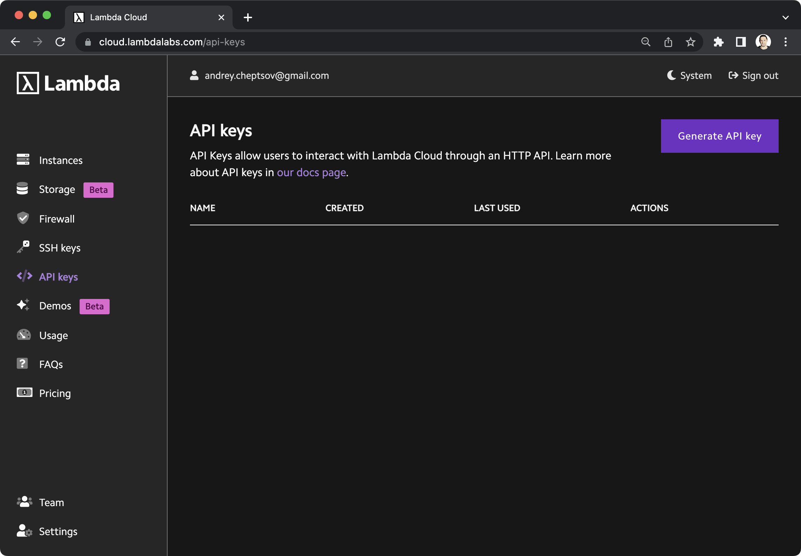

# Lambda Cloud

The `Lambda` backend allows provisioning infrastructure in Lambda Cloud while storing state and 
artifacts in an S3 bucket.

Follow the step-by-step guide below to configure a project with this backend.

## 1. Set up an S3 storage

As Lambda Cloud doesn't have its own object storage, `dstack` requires you to specify an S3 bucket, 
along with AWS credentials, for storing state and artifacts.

### 1.1. Create an S3 bucket

First, you need to create an S3 bucket. `dstack` will use this bucket to store state and artifacts.

### 1.2. Create an IAM user

The next step is to [create an IAM user](https://docs.aws.amazon.com/IAM/latest/UserGuide/id_users_create.html) and grant this user permissions to perform actions on the `s3` service.

??? info "Logs and secrets"
    If you want `dstack` to also store logs and secrets, you can optionally grant permissions 
    to the `logs` and `secretsmanager` services.

### 1.3. Create an access key

To create an access key,
[follow this guide](https://docs.aws.amazon.com/cli/latest/userguide/cli-authentication-user.html#cli-authentication-user-get). Once the access key is created, make sure to download the `.csv` file containing your IAM user's
`Access key ID` and `Secret access key`.

## 2. Set up API key

Then, you'll need a Lambda Cloud API key. Log into your Lambda Cloud account, click `API keys` in the sidebar, and then
click the `Generate API key` button to create a new API key.

{ width=800 }

## 3. Create a project

Now that you have AWS and Lambda credentials set up, log in to the Hub, open the `Projects` page, click `Add`, and select `Lambda` in the `Type` field.

{ width=800 }

### Fields reference

The following fields are required:

- `API Key` - (Required) The API key for authenticating `dstack` with Lambda API
- `Regions` - (Required) The regions where `dstack` will provision compute resources
- `Storage` - (Required) The storage type that `dstack` will use to store state and artifacts
- `Access key ID` - (Required) The Access key ID for authenticating `dstack` with S3
- `Secret access key` - (Required) The Secret access key for authenticating `dstack` with S3
- `Bucket` - (Required) The storage bucket that `dstack` will use to store state and artifacts

## 4. Configure the CLI

!!! info "NOTE:"
    Once you have created the project, feel free to use the CLI code snippet to configure it for use with the created project.

    [Learn more →](../../../guides/projects#configuring-the-cli){ .md-button .md-button--primary }

[//]: # (TODO: Mention on how to manage EC2 quotas)