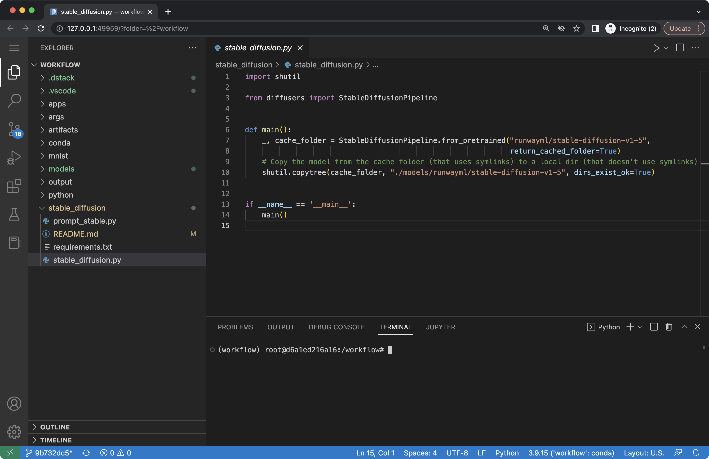

# Dev environments

Before creating a workflow that runs perfectly in the cloud, you may need to debug it.
The [`code`](../reference/providers/code.md), [`lab`](../reference/providers/lab.md),
and [`notebook`](../reference/providers/notebook.md) can
help you do that by providing a way to launch interactive development environments.

## VS Code

The `code` provider runs a VS Code application.

<div editor-title=".dstack/workflows/dev-environments.yaml">

```yaml
workflows:
  - name: ide-code
    provider: code
```

</div>

If you run it, you'll see the URL:

<div class="termy">

```shell
$ dstack run ide-code

RUN         WORKFLOW  SUBMITTED  STATUS     TAG  BACKEND
lionfish-1  ide-code  now        Submitted       local

Starting SSH tunnel...

To interrupt, press Ctrl+C.

Web UI available at http://127.0.0.1:51303/?tkn=f2de121b04054f1b85bb7c62b98f2de1
```

</div>

If you click the URL, it will open the VS Code application in the browser:



For more details, check the [reference](../reference/providers/code.md).

!!! info "NOTE:"
    The `code` provider offers all the features that the `bash` provider does. This includes the ability to run both locally and
    remotely, set up [Resources](resources.md), run [Python](python.md) and [Apps](apps.md), use [Deps](deps.md), 
    [Artifacts](artifacts.md), etc.

    See [Reference](../reference/providers/code.md) for more details.

## Notebooks

Similar to `code`, the `lab` and `notebook` providers allow to run JupyterLab and Jupyter notebooks 
correspondingly.

See [Reference](../reference/providers/lab.md) for more details.

## SSH

Instead of using [`code`](../reference/providers/code.md), [`lab`](../reference/providers/lab.md),
and [`notebook`](../reference/providers/notebook.md), you can use the bash provider and connect your own IDE to the
running workflow via SSH.

Here's an example:

<div editor-title=".dstack/workflows/dev-environments.yaml">

```yaml
workflows:
  - name: hello-ssh
    provider: bash
    commands:
      - tail -f /dev/null
    ssh: true 
```

</div>

When you run this workflow, it will prompt you to connect to it via SSH.

<div class="termy">

```shell
$ dstack run hello-ssh
 RUN          WORKFLOW    SUBMITTED  STATUS     TAG  BACKENDS
 moody-emu-1  hello-ssh   now        Submitted       local

Starting SSH tunnel...

To interrupt, press Ctrl+C.

To connect via SSH, use:
  ssh -i /Users/cheptsov/.ssh/id_rsa root@localhost -p 56947
```

</div>

Now, you can use any IDE of your choice to connect to the running workflow.