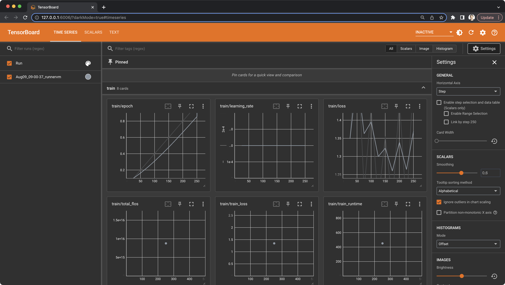

# Fine-tuning Llama 2

The release of Llama 2 by Meta has caused quite a stir due to its impressive performance and its license that permits commercial use.
Along with other advancements in the LLM toolchain, such as LangChain and vector databases, Llama 2 has vast potential
for applications.

This example demonstrates how to use `dstack` to fine-tune [`llama-2-7b-chat-hf`](https://huggingface.co/meta-llama/Llama-2-7b-chat-hf), 
using any cloud of your choice.

## Preparing a dataset

When selecting a dataset, make sure that it is pre-processed to match the prompt format of Llama 2:

```text
<s>[INST] <<SYS>>
System prompt
<</SYS>>

User prompt [/INST] Model answer </s>
```

In our example, we'll use the [`mlabonne/guanaco-llama2-1k`](https://huggingface.co/datasets/mlabonne/guanaco-llama2-1k)
dataset. It is a 1K sample from
the [`timdettmers/openassistant-guanaco`](https://huggingface.co/datasets/timdettmers/openassistant-guanaco) dataset
converted to Llama 2's format.

## Defining the training script

The most notable libraries that we'll use are [`peft`](https://github.com/huggingface/peft) (required for using the QLoRA
technique), [`bitsandbytes`](https://github.com/TimDettmers/bitsandbytes) (required for using
the quantization technique), and [`trl`](https://github.com/lvwerra/trl) (required for supervised fine-tuning).

<div editor-title="llama-2/requirements.txt">

```text
accelerate==0.21.0
peft==0.4.0
bitsandbytes==0.40.2
transformers==4.31.0
trl==0.4.7
```

</div>

In the first part of our script, we prepare the `bitsandbytes` config and load the base model along
with its tokenizer, based on the script arguments.

```python
from transformers import (
    AutoModelForCausalLM,
    AutoTokenizer,
    BitsAndBytesConfig,
)

def create_and_prepare_model(args):
    bnb_config = BitsAndBytesConfig(
        load_in_4bit=args.use_4bit,
        bnb_4bit_quant_type=args.bnb_4bit_quant_type,
        bnb_4bit_compute_dtype=args.bnb_4bit_compute_dtype,
        bnb_4bit_use_double_quant=args.use_nested_quant,
    )

    model = AutoModelForCausalLM.from_pretrained(
        args.model_name,
        quantization_config=bnb_config,
        device_map="auto",
    )

    model.config.use_cache = False
    model.config.pretraining_tp

    tokenizer = AutoTokenizer.from_pretrained(args.model_name, trust_remote_code=True)

    tokenizer.pad_token = tokenizer.eos_token
    tokenizer.padding_side = "right"

    return model, tokenizer
```

In the second part of our script, we prepare the `peft` config and create the trainer based on the script arguments.

```python
from peft import LoraConfig
from transformers import TrainingArguments
from trl import SFTTrainer

def create_and_prepare_trainer(model, tokenizer, dataset, args):
    training_arguments = TrainingArguments(
        output_dir=args.output_dir,
        num_train_epochs=args.num_train_epochs,
        per_device_train_batch_size=args.per_device_train_batch_size,
        gradient_accumulation_steps=args.gradient_accumulation_steps,
        optim=args.optim,
        save_steps=args.save_steps,
        logging_steps=args.logging_steps,
        learning_rate=args.learning_rate,
        weight_decay=args.weight_decay,
        fp16=args.fp16,
        bf16=args.bf16,
        max_grad_norm=args.max_grad_norm,
        max_steps=args.max_steps,
        warmup_ratio=args.warmup_ratio,
        group_by_length=args.group_by_length,
        lr_scheduler_type=args.lr_scheduler_type,
    )

    peft_config = LoraConfig(
        lora_alpha=args.lora_alpha,
        lora_dropout=args.lora_dropout,
        r=args.lora_r,
        bias="none",
        task_type="CAUSAL_LM",
    )

    trainer = SFTTrainer(
        model=model,
        train_dataset=dataset,
        peft_config=peft_config,
        dataset_text_field="text",
        max_seq_length=args.max_seq_length,
        tokenizer=tokenizer,
        args=training_arguments,
        packing=args.packing,
    )

    return trainer
```

In the third part of the script, we merge the base model with the fine-tuned model and push it to the Hugging Face Hub.

```python
from peft import PeftModel
import torch
from transformers import (
    AutoModelForCausalLM,
    AutoTokenizer
)

def merge_and_push(args):
    # Reload model in FP16 and merge it with LoRA weights
    base_model = AutoModelForCausalLM.from_pretrained(
        args.model_name,
        low_cpu_mem_usage=True,
        return_dict=True,
        torch_dtype=torch.float16,
        device_map="auto",
    )
    model = PeftModel.from_pretrained(base_model, args.new_model_name)
    model = model.merge_and_unload()

    # Reload the new tokenizer
    tokenizer = AutoTokenizer.from_pretrained(
        args.model_name, trust_remote_code=True
    )
    tokenizer.pad_token = tokenizer.eos_token
    tokenizer.padding_side = "right"

    # Publish the new model to Hugging Face Hub
    model.push_to_hub(args.new_model_name, use_temp_dir=False)
    tokenizer.push_to_hub(args.new_model_name, use_temp_dir=False)
```

Finally, in the main part of the script, we put it all together.

```python
from dataclasses import dataclass
from datasets import load_dataset
from transformers import HfArgumentParser

@dataclass
class ScriptArguments:
    # ...

if __name__ == "__main__":
    parser = HfArgumentParser(ScriptArguments)
    args = parser.parse_args_into_dataclasses()[0]

    dataset = load_dataset(args.dataset_name, split="train")

    model, tokenizer = create_and_prepare_model(args)

    trainer = create_and_prepare_trainer(model, tokenizer, dataset, args)

    trainer.train()
    trainer.model.save_pretrained(args.new_model_name)

    if args.merge_and_push:
        merge_and_push(args)
```

## Defining a profile

!!! info "NOTE:"
    Before using `dstack` with a particular cloud, make sure to [configure](../docs/projects.md) the corresponding project.

The `llama-2-7b-chat-hf` model requires at least `14GB` in full precision (not counting the overhead). Considering that we
plan to use the QLoRA and quantization techniques, an `NVIDIA T4` GPU may be sufficient.

To inform `dstack` about the required resources, you need to 
[define](../docs/reference/profiles.yml.md) a profile via the `.dstack/profiles.yaml` file within your project:

<div editor-title=".dstack/profiles.yml"> 

```yaml
profiles:
  - name: gcp-t4
    project: gcp
    
    resources:
      memory: 24GB
      gpu:
        name: T4
        
    spot_policy: auto
    retry_policy:
      limit: 30min
    max_duration: 1d
      
    default: true
```

</div>

!!! info "Using spot instances"
    If `spot_policy` is set to `auto`, `dstack` prioritizes spot instances.
    If these are unavailable, it uses `on-demand` instances. To cut costs, set `spot_policy` to `spot`.
    
    If `dstack` can't find capacity, an error displays. To enable continuous capacity search, use `retry_policy` with a 
    `limit`. For example, setting it to `30min` makes `dstack` search for capacity for 30 minutes.

    Note that spot instances are significantly cheaper but can be interrupted. Your code should ideally 
    handle interruptions and resume work from saved checkpoints.

## Running the task

Here's the configuration that runs the training task via `dstack`:

<div editor-title="llama-2/train.dstack.yml"> 

```yaml
type: task

env: 
  # (Required) Specify your Hugging Face token to publish the fine-tuned model
  - HUGGING_FACE_HUB_TOKEN=

ports:
  - 6006

commands:
  - echo "Installing requirements..."
  - pip -q install -r llama-2/requirements.txt
  - tensorboard --logdir results/runs &
  - python llama-2/train.py --merge_and_push ${{ run.args }}
```

</div>

Here's how you run it with `dstack`:

<div class="termy">

```shell
$ dstack run . -f llama-2/train.dstack.yml --num_train_epochs 10 

Installing requirements...
TensorBoard 2.14.0 at http://127.0.0.1:6006/ (Press CTRL+C to quit)
{'loss': 1.3491, 'learning_rate': 0.0002, 'epoch': 0.1}
{'loss': 1.6299, 'learning_rate': 0.0002, 'epoch': 0.2}
{'loss': 1.2071, 'learning_rate': 0.0002, 'epoch': 0.3}
```

</div>

`dstack` will provision the cloud instance corresponding to the configured project and profile, run the training, and
tear down the cloud instance once the training is complete.

??? info "Tensorboard"
    Since we've executed `tensorboard` within our task and configured its port using `ports`,
    you can access it using the URL provided in the output. `dstack` automatically forwards
    the configured port to your local machine.

    

!!! info "Source code"
    The complete and ready-to-run code for the example is available in our [GitHub repo](https://github.com/dstackai/dstack-examples).