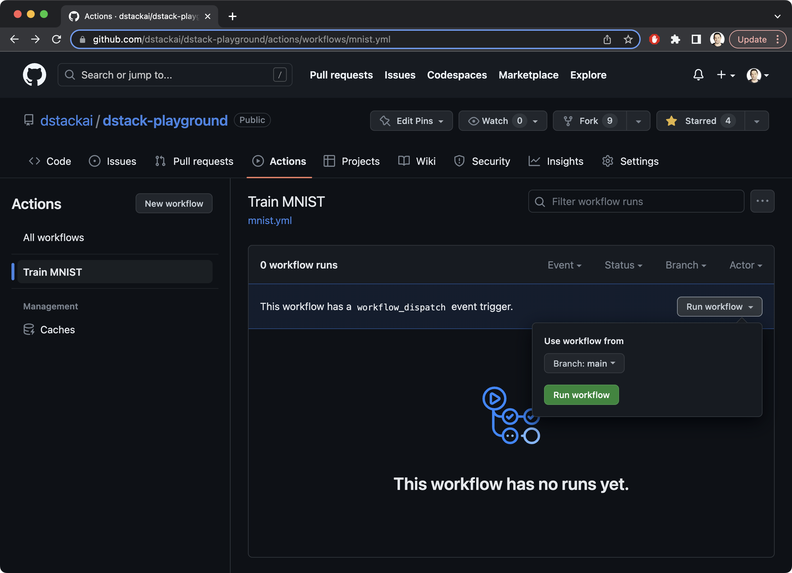

# GitHib Actions 

This example demonstrates how to use GitHub Actions to trigger `dstack` workflows on
commits, manually, scheduled time, or via REST API. 

GitHub Actions handle events, whereas `dstack` assists in provisioning the required cloud resources, executing the
workflow, and managing artifacts.

!!! info "NOTE:"
    The source code of this example is available in the [Playground](../playground.md).

## 1. Prerequisites

To proceed, you will need a GitHub repository containing a workflow that you intend to trigger. 
You may create a new repository or fork [`dstackai/dstack-playground`](https://github.com/dstackai/dstack-playground).

Below, we'll use
the [`train-mnist`](https://github.com/dstackai/dstack-playground/blob/main/.dstack/workflows/mnist.yaml) workflow
from [`dstackai/dstack-playground`](https://github.com/dstackai/dstack-playground).

## 2. Define a GitHub workflow

Create and push this GitHub workflow to the repository.

<div editor-title=".github/workflows/mnist.yml"> 

```yaml
name: Train MNIST

on:
  workflow_dispatch:

jobs:
  init:
    runs-on: ubuntu-latest
    env:
      AWS_ACCESS_KEY_ID: ${{ secrets.AWS_ACCESS_KEY_ID }}
      AWS_SECRET_ACCESS_KEY: ${{ secrets.AWS_SECRET_ACCESS_KEY }}
    steps:
      - uses: actions/checkout@v3
      - uses: actions/setup-python@v4
      - name: Install dstack
        run: |
          pip install dstack
      - name: Configure the AWS remote
        run: |
          dstack config aws --bucket ${{ secrets.DSTACK_AWS_S3_BUCKET }} --region ${{ secrets.DSTACK_AWS_REGION }}
      - name: Initialize dstack
        run: |
          ssh-keygen -b 2048 -t rsa -f ~/.ssh/id_rsa -q -N ""
          dstack init --token ${{ secrets.GITHUB_TOKEN }}
      - name: Run dstack workflow
        run: |
          dstack run train-mnist --remote --gpu 1
```

</div>

This workflow checks the source code, installs `dstack`, [configures](../reference/cli/config.md) a remote for
running `dstack` workflows (such as [AWS](../setup/aws.md) or [GCP](../setup/gcp.md)), [initializes](../reference/cli/init.md) `dstack` (needs `~/.ssh/id_rsa` to exist),
and [runs](../reference/cli/run.md) the workflow.

!!! info "NOTE:"
    By default, `dstack` run runs the workflow in attached mode, which means it waits for the workflow to finish and streams real-time 
    output. To run the workflow in detached mode, add the `-d` flag with `dstack run` if needed.

## 3. Configure GitHub secrets

In order to run, our workflow requires several secrets t obe configured for your GitHub repository:

- `AWS_ACCESS_KEY_ID` – The access key ID of the AWS account to run the workflow
- `AWS_SECRET_ACCESS_KEY` – The secret access key of the AWS account to run the workflow
- `DSTACK_AWS_S3_BUCKET` - The name of the existing S3 bucket to use for saving artifacts
- `DSTACK_AWS_REGION` – The AWS region to run the workflow

## 4. Trigger manually

As we're using the `workflow_dispatch` event, it's possible to manually trigger it via the user interface provided by GitHub.



## 5. Trigger via REST API

Another option is to trigger
it [programmatically](https://docs.github.com/en/rest/actions/workflows?apiVersion=2022-11-28#create-a-workflow-dispatch-event)
by using the REST API instead of manual triggering.

<div class="termy">

```shell
$ curl -L -X POST \
  -H "Accept: application/vnd.github+json" \
  -H "Authorization: Bearer $GITHUB_TOKEN" \
  https://api.github.com/repos/dstackai/dstack-playground/actions/workflows/mnist.yml/dispatches \
  -d '{"ref":"main"}'

```

</div>

## 6. Trigger at scheduled time 

The `on` property in the GitHub workflow file allows us to configure
which [events trigger the workflow](https://docs.github.com/en/actions/using-workflows/events-that-trigger-workflows).

If we want to schedule the workflow to run at a specific time, we can use the following code.

```yaml
on:
  schedule:
    - cron:  '30 5,17 * * *'
```

This expression will instruct GitHub to automatically trigger the workflow every day at 5:30 and 17:30 UTC.