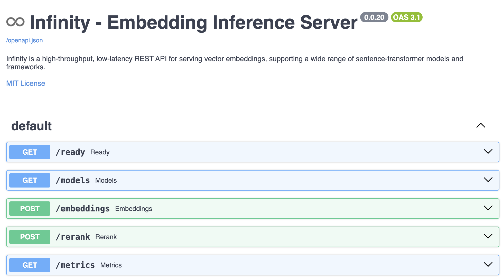

# Infinity

This example demonstrates how to use [Infinity](https://github.com/michaelfeil/infinity) with `dstack`'s [services](../docs/concepts/services.md) to deploy any [SentenceTransformers](https://github.com/UKPLab/sentence-transformers/) based embedding models and interact with them via the endpoint

## Define the configuration

To deploy a `SentenceTransformers` based embedding models using `Infinity`, you need to define the following configuration file at minimum:

<div editor-title="text-generation-inference/serve.dstack.yml"> 

```yaml
type: service

image: michaelf34/infinity:latest

env:
  - MODEL_ID=BAAI/bge-small-en-v1.5
  - PORT=7997

port: 7997

commands:
  - infinity_emb --model-name-or-path $MODEL_ID --port $PORT
```

</div>

The `port` on top level defines which port to allow users to connect from public to cloud instance while the `env:PORT` defines the port number of endpoint to interact with Infinity. Hence this could be simplified as ( users ▶️ `port` ▶️ `env:PORT` ▶️ Infinity )

## Run the configuration

!!! warning "Gateway"
    Before running a service, ensure that you have configured a [gateway](../docs/concepts/services.md#set-up-a-gateway).
    If you're using dstack Cloud, the default gateway is configured automatically for you.

<div class="termy">

```shell
$ dstack run . -f infinity/serve.dstack.yml --gpu 16GB
```

</div>

!!! info "Endpoint URL"
    Once the service is deployed, its endpoint will be available at 
    `https://<run-name>.<domain-name>` (using the domain set up for the gateway).

    If you wish to customize the run name, you can use the `-n` argument with the `dstack run` command.

## Swagger UI

Once the service is up, you can reach out Swagger UI via `https://<run-name>.<domain-name>/docs` to find out full list of supported APIs.



## Interacting via `openai` package

Any embedding models served by Infinity automatically comes with [OpenAI's Embeddings APIs](https://platform.openai.com/docs/guides/embeddings) compatible APIs, so we can directly use `openai` package to interact with deployed Infinity.

Below example shows a simple usage, and it assumes that you have already installed `openai` package by running `pip install openai` command.

<div class="termy">

```python
from openai import OpenAI
from functools import partial

url = "https://<run-name>.<domain-name>"
client = OpenAI(api_key="dummy", base_url=url)

client.embeddings.create = partial(
  client.embeddings.create, model="bge-small-en-v1.5"
)
res = client.embeddings.create(input=["A sentence to encode."])
```

We only deployed a single model(`bge-small-en-v1.5`), but the OpenAI compatible API still requires to input `model` parameter. That is why the above code snippet replace `client.embeddings.create` function with fixed `model` parameter as `bge-small-en-v1.5`. In this way, we don't have to specify the same model name every time.

If you print out the `res`, you will see the similar output as below. 

```python
CreateEmbeddingResponse(data=[Embedding(embedding=[-0.04206925258040428, -0.005285350140184164, -0.04020832106471062, -0.031132467091083527, ......, -0.06217341125011444], index=0, object='embedding')], model='BAAIbge-small-en-v1.5', object='embedding', usage=Usage(prompt_tokens=21, total_tokens=21), id='infinity-ee7889bb-1aa9-47f7-8d50-0ab1b4cfba19', created=1706104705) 
```

The entire output is wrapped in `CreateEmbeddingResponse`, and the `data` attribute of it could be inserted into a vector database for later use.

</div>

## Source code
    
The complete, ready-to-run code is available in [dstackai/dstack-examples](https://github.com/dstackai/dstack-examples).

## What's next?

1. Check the [Text Embeddings Inference](tei.md), [TGI](tgi.md), and [vLLM](vllm.md) examples
2. Read about [services](../docs/concepts/services.md)
3. Browse all [examples](index.md)
4. Join the [Discord server](https://discord.gg/u8SmfwPpMd)