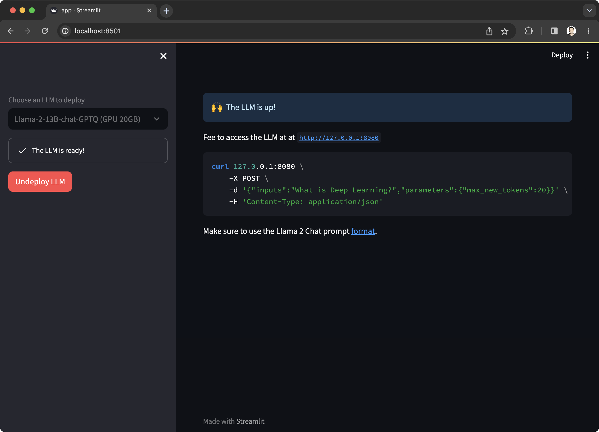

# RAG with Llama Index and Weaviate

RAG, or retrieval-augmented generation, empowers LLMs by providing them with access to your data.

Here's an example of how to apply this technique using the [Llama Index](https://www.llamaindex.ai/) framework 
and [Weaviate](https://weaviate.io/) vector database.

??? info "About Llama Index"
    Llama Index is an open-source framework that makes it easy extract data from different sources and connect
    it to LLMs. It provides a variety of tools and APIs to help you ingest, structure, and access your data in a way that is
    easy for LLMs to consume.

??? info "About Weaviate"
    Weaviate is an open-source vector database that allows you to store and query objects 
    using their vector representations, also known as embeddings.
    A vector representation is a mathematical way of representing an object as a point in a high-dimensional space.
    This allows Weaviate to perform semantic search, which is the ability to search for objects based on their meaning,
    rather than just their exact match to a query.

## How does it work?

1. Llama Index loads data from local files, structures it into chunks, and ingests it into Weaviate. It uses local
  embeddings through the [SentenceTransformers](https://www.sbert.net/) library.
2. `dstack` allows us to configure cloud accounts (e.g. AWS, GCP, Azure, or Lambda Cloud), 
  and deploy LLMs (e.g. Llama 2) there. In this example, it employs [Text Generation Inference](https://github.com/huggingface/text-generation-inference)
  to serve the LLM. Refer to [Deploying LLMs using TGI](text-generation-inference.md) and [Deploying LLMs via Python API](deploy-python.md).
3. Llama Index allows us to prompt the LLM and automatically incorporates context from Weaviate. 
 
## Requirements

Here's the list of Python libraries that we'll use:

```
weaviate-client
llama-index
sentence-transformers
text_generation
```

## Load data to Weaviate

The first thing we do is load the data from local files and ingest it into Weaviate.

!!! info "NOTE:"
    To use Weaviate, you need to either [install](https://weaviate.io/developers/weaviate/installation) 
    it on-premises or sign up for their managed service.

Since we're going to load data into or from Weaviate, we'll need a `weaviate.Client`:

```python
import os

import weaviate

auth_config = weaviate.AuthApiKey(api_key=os.getenv("WEAVIATE_API_TOKEN"))

client = weaviate.Client(url=os.getenv("WEAVIATE_URL"), auth_client_secret=auth_config)

client.schema.delete_class("DstackExample")
```

Next, prepare the Llama Index classes: `llama_index.ServiceContext` (for indexing and querying) and
`llama_index.StorageContext` (for loading and storing). Note that we're using
`langchain.embeddings.huggingface.HuggingFaceEmbeddings` for local embeddings instead of OpenAI.

```python
from langchain.embeddings.huggingface import HuggingFaceEmbeddings

from llama_index import (
    LangchainEmbedding,
    ServiceContext,
    StorageContext,
)
from llama_index.vector_stores import WeaviateVectorStore

embed_model = LangchainEmbedding(HuggingFaceEmbeddings())

service_context = ServiceContext.from_defaults(embed_model=embed_model, llm=None)

vector_store = WeaviateVectorStore(weaviate_client=client, index_name="DstackExample")

storage_context = StorageContext.from_defaults(vector_store=vector_store)
```

Once the utility classes are configured, we can load the data from local files and pass it to
`llama_index.VectorStoreIndex`. Using its `from_documents` method will then store the data in the vector database.

```python
from pathlib import Path

from llama_index import (
    SimpleDirectoryReader,
    VectorStoreIndex,
)

documents = SimpleDirectoryReader(Path(__file__).parent / "data").load_data()

index = VectorStoreIndex.from_documents(
    documents,
    service_context=service_context,
    storage_context=storage_context,
)
```

The data is in the vector database! Now we can proceed with the part where we invoke an LLM using this data as context.

## Deploy an LLM

This example assumes we're using an LLM deployed with `dstack` which can be set up either as a task (for development) or
as a service (for production).

For a detailed example on how to deploy an LLM as a service, check out
[Deploying LLMs using TGI](text-generation-inference.md).

Alternatively, for development purposes, you can also check out [Deploying LLMs using Python API](deploy-python.md). The example comes with a simple
Streamlit app that allows you to deploy an LLM as a task with just one click.



## Generate response

Once the LLM is up, we can prompt it through Llama Index to automatically incorporate context from Weaviate.

Since we'll invoke the actual LLM, when configuring `llama_index.ServiceContext`, we must include the LLM configuration.

In our example, using an LLM deployed with dstack via TGI, we'll use the `langchain.HuggingFaceTextGenInference` wrapper.
This wrapper requires the LLM's URL and other LLM parameters.

!!! info "NOTE:"
    If you've deployed the LLM using [Deploying LLMs using Python API](deploy-python.md),
    make sure to set the `TGI_ENDPOINT_URL` to `http://localhost:8080`.

```python
import os

from llama_index import (
    LangchainEmbedding,
    PromptHelper,
    ServiceContext,
    VectorStoreIndex,
)

from langchain import HuggingFaceTextGenInference
from langchain.embeddings.huggingface import HuggingFaceEmbeddings

from llama_index.llm_predictor import LLMPredictor
from llama_index.vector_stores import WeaviateVectorStore

embed_model = LangchainEmbedding(HuggingFaceEmbeddings())

llm_predictor = LLMPredictor(
    llm=HuggingFaceTextGenInference(
        inference_server_url=os.getenv("TGI_ENDPOINT_URL"),
        max_new_tokens=512,
        streaming=True,
    ),
)

service_context = ServiceContext.from_defaults(
    embed_model=embed_model,
    llm_predictor=llm_predictor,
    prompt_helper=PromptHelper(context_window=1024),
)

vector_store = WeaviateVectorStore(weaviate_client=client, index_name="DstackExample")

index = VectorStoreIndex.from_vector_store(
    vector_store, service_context=service_context
)
```

Once `llama_index.VectorStoreIndex` is ready, we can proceed with querying it.

!!! info "NOTE:"
    If we're deploying Llama 2, we have to ensure that the prompt format is correct.

```python
from llama_index import (QuestionAnswerPrompt, RefinePrompt)

text_qa_template = QuestionAnswerPrompt(
        """<s>[INST] <<SYS>>
We have provided context information below. 

{context_str}

Given this information, please answer the question.
<</SYS>>

{query_str} [/INST]"""
    )

refine_template = RefinePrompt(
    """<s>[INST] <<SYS>>
The original query is as follows: 

{query_str}

We have provided an existing answer:

{existing_answer}

We have the opportunity to refine the existing answer (only if needed) with some more context below.

{context_msg}
<</SYS>>

Given the new context, refine the original answer to better answer the query. If the context isn't useful, return the original answer. [/INST]"""
)

query_engine = index.as_query_engine(
    text_qa_template=text_qa_template,
    refine_template=refine_template,
    streaming=True,
)

response = query_engine.query("Make a bullet-point timeline of the authors biography?")
response.print_response_stream()
```

That's it! This basic example shows how straightforward it is to use Llama Index and Weaviate with the LLMs deployed
using `dstack`. For more in-depth information, we encourage you to explore the documentation for each tool.

## Source code

!!! info "Source code"
    The complete, ready-to-run code is available in [dstackai/dstack-examples](https://github.com/dstackai/dstack-examples).