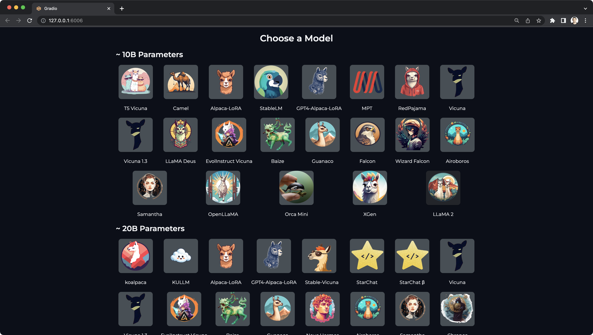
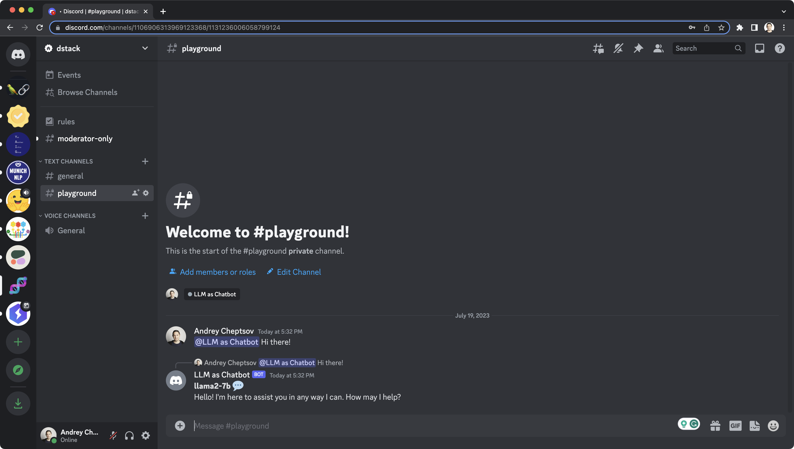

# LLM as Chatbot

This [example](https://github.com/deep-diver/LLM-As-Chatbot) is built by Chansung Park. It can run any open-source LLM either as a Gradio chat app or as a Discord bot.
With `dstack`, you can run this Gradio chat app or Discord bot in any cloud with a single command.
To try this example with `dstack`, follow the instructions below.

## Prerequisites

!!! info "NOTE:"
    Before using `dstack` with a particular cloud, make sure to [configure](../docs/guides/projects.md) the corresponding project.

Each LLM model requires specific resources. To inform `dstack` about the required resources, you need to 
[define](../docs/reference/profiles.yml.md) a profile via the `.dstack/profiles.yaml` file within your project.

Below is a profile that will provision a cloud instance with `24GB` of memory and a `T4` GPU in the `gcp` project.

<div editor-title=".dstack/profiles.yml"> 

```yaml
profiles:
  - name: gcp-t4
    project: gcp
    resources:
      memory: 24GB
      gpu:
        name: T4
    default: true
```

</div>

## Run a Gradio app

Here's the configuration that runs the Gradio app:

<div editor-title="gradio.dstack.yml"> 

```yaml
type: task

env:
  # (Optional) Specify your Hugging Face token
  - HUGGING_FACE_HUB_TOKEN=
  # (Optional) Specify your Serper API Key
  - LLMCHAT_SERPER_API_KEY=

ports:
  - 6006

commands:
  - pip install -r requirements.txt
  - LLMCHAT_APP_MODE=GRADIO python entry_point.py
```

</div>

Here's how you run it with `dstack`:

<div class="termy">

```shell
$ dstack run . -f gradio.dstack.yml
```

</div>

`dstack` will provision the cloud instance, run the task, and forward the defined ports to your local
machine for secure and convenient access.

{ width=800 }

!!! info "NOTE:"
    To use a non-default profile, simply specify its name with `--profile NAME` when using `dstack run`.

## Run a Discord bot

Here's the configuration that runs the Gradio app:

<div editor-title="discord.dstack.yml"> 

```yaml
type: task

env:
  # (Required) Specify your Discord bot token.
  - DISCORD_BOT_TOKEN=
  # (Required) Specify the name of the model. See `README.md`` for supported models.
  - DISCORD_BOT_MODEL_NAME=alpaca-lora-7b
  # (Optional) Specify your Hugging Face token
  - HUGGING_FACE_HUB_TOKEN=
  # (Optional) Specify your Serper API Key to enable Internet search support.
  - LLMCHAT_SERPER_API_KEY=

commands:
  - pip install -r requirements.txt --progress-bar off
  - LLMCHAT_APP_MODE=DISCORD python entry_point.py
```

</div>

??? info "How to acquire a Discord bot token"
    Before running, ensure you have specified your Discord bot token, which you can obtain from the [Discord Developer
    Portal](https://discord.com/developers/docs/intro). If you haven't set up a Discord Bot on the portal yet, 
    follow the [How to Create a Discord Bot Account](https://www.freecodecamp.org/news/create-a-discord-bot-with-python/) 
    section of the tutorial from freeCodeCamp.

  

Finally, here's how you run it with `dstack`:

<div class="termy">

```shell
$ dstack run . -f discord.dstack.yml
```

</div>

Once you confirm, `dstack` will provision the cloud instance and run the task. Once it's up, you can freely send messages
to your bot via Discord.

{ width=800 }

For advanced commands supported by the bot, check the [README](https://github.com/deep-diver/LLM-As-Chatbot#discord-bot) file.

[Source code](https://github.com/deep-diver/LLM-As-Chatbot){ .md-button .md-button--github }
    