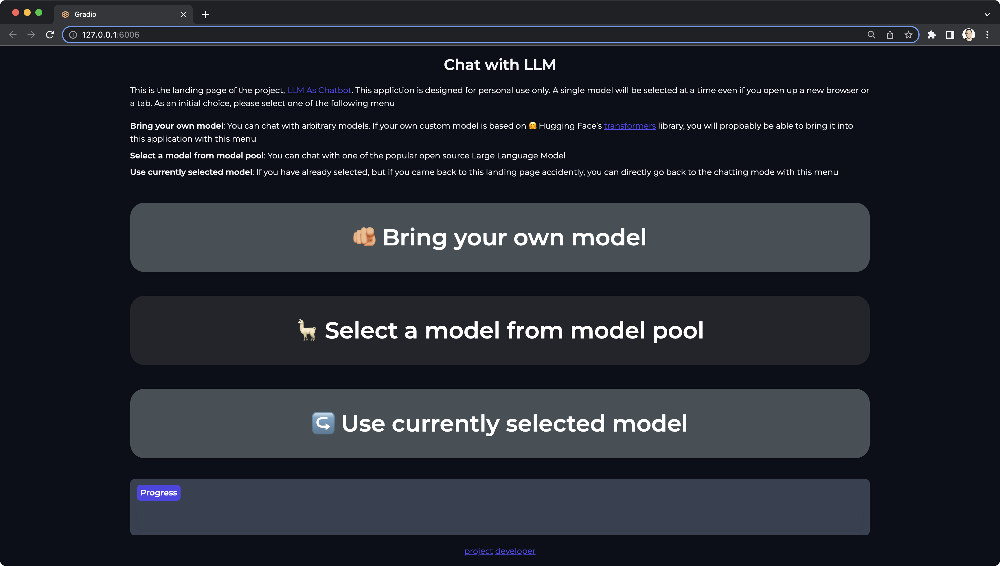

# LLM as Chatbot

{ width=800 }

This [example](https://github.com/deep-diver/LLM-As-Chatbot) is built by Chansung Park. It can run any open-source LLM either as a Gradio chat app or as a Discord bot.
With `dstack`, you can run this Gradio chat app or Discord bot in any cloud with a single command.
To give it a try, follow the instructions below.

## 1. Define a profile

??? info "Prerequisites"
    Before running the example, ensure that you have [installed](../docs/installation/pip.md) `dstack` and [configured a project](../docs/guides/projects.md) 
    to use your preferred cloud account (AWS, GCP, Azure, or Lambda Cloud).

Each LLM model requires specific resources. To inform dstack about the required resources, you need to define a profile
in the `.dstack/profiles.yaml` file within your project.

Each profile must include the project name, and you have the option to specify the GPU name, its memory, instance type,
retry policy, and more. Check the [reference](../docs/reference/profiles.yml.md) for more details.

<div editor-title=".dstack/profiles.yml"> 

```yaml
profiles:
  - name: gcp-t4
    project: gcp
    resources:
      gpu:
        name: T4
    default: true
```

</div>

If you use this profile, dstack will utilize the project named `gcp` and a cloud instance that has an NVIDIA T4 GPU.

## 2. Run a Gradio app

Here's the configuration that runs the Gradio app:

<div editor-title="gradio.dstack.yml"> 

```yaml
type: task

env:
  # (Optional) Specify your Hugging Face token
  - HUGGING_FACE_HUB_TOKEN=
  # (Optional) Specify your Serper API Key
  - LLMCHAT_SERPER_API_KEY=

ports:
  - 6006

commands:
  - pip install -r requirements.txt
  - LLMCHAT_APP_MODE=GRADIO python entry_point.py
```

</div>

Here's how you run it with `dstack`:

<div class="termy">

```shell
$ dstack run . -f gradio.dstack.yml

dstack will execute the following plan:

CONFIGURATION      PROJECT  INSTANCE      RESOURCES              SPOT
gradio.dstack.yml  gcp      n1-highmem-2  2xCPUs, 13312MB, 1xT4  auto

Continue? [y/n]: y

Provisioning and establishing an SSH tunnel...

Running on local URL:  http://127.0.0.1:6006

To interrupt, press Ctrl+C...
```

</div>

After you confirm, `dstack` will provision the cloud instance, run the task, and forward the defined ports to your local
machine for secure and convenient access.

{ width=800 }

!!! info "NOTE:"
    To use a non-default profile, simply specify its name with `--profile NAME` when using `dstack run`.

## 3. Run a Discord bot

Here's the configuration that runs the Gradio app:

<div editor-title="discord.dstack.yml"> 

```yaml
type: task

env:
  # (Required) Specify your Discord bot token.
  - DISCORD_BOT_TOKEN=
  # (Required) Specify the name of the model. See `README.md`` for supported models.
  - DISCORD_BOT_MODEL_NAME=alpaca-lora-7b
  # (Optional) Specify your Hugging Face token
  - HUGGING_FACE_HUB_TOKEN=
  # (Optional) Specify your Serper API Key to enable Internet search support.
  - LLMCHAT_SERPER_API_KEY=

commands:
  - pip install -r requirements.txt --progress-bar off
  - LLMCHAT_APP_MODE=DISCORD python entry_point.py
```

</div>

??? info "How to acquire a Discord bot token"
    Before running, ensure you have specified your Discord bot token, which you can obtain from the [Discord Developer
    Portal](https://discord.com/developers/docs/intro). If you haven't set up a Discord Bot on the portal yet, 
    follow the [How to Create a Discord Bot Account](https://www.freecodecamp.org/news/create-a-discord-bot-with-python/) 
    section of the tutorial from freeCodeCamp.

  

Finally, here's how you run it with `dstack`:

<div class="termy">

```shell
$ dstack run . -f discord.dstack.yml

dstack will execute the following plan:

CONFIGURATION       PROJECT  INSTANCE      RESOURCES              SPOT
discord.dstack.yml  gcp      n1-highmem-2  2xCPUs, 13312MB, 1xT4  auto

Continue? [y/n]: y

Provisioning...

To interrupt, press Ctrl+C...
```

</div>

Once you confirm, `dstack` will provision the cloud instance and run the task. Once it's up, you can freely send messages
to your bot via Discord.

{ width=800 }

For advanced commands supported by the bot, check the [README](https://github.com/deep-diver/LLM-As-Chatbot#discord-bot) file.

[Source code](https://github.com/deep-diver/LLM-As-Chatbot){ .md-button .md-button--github }
    