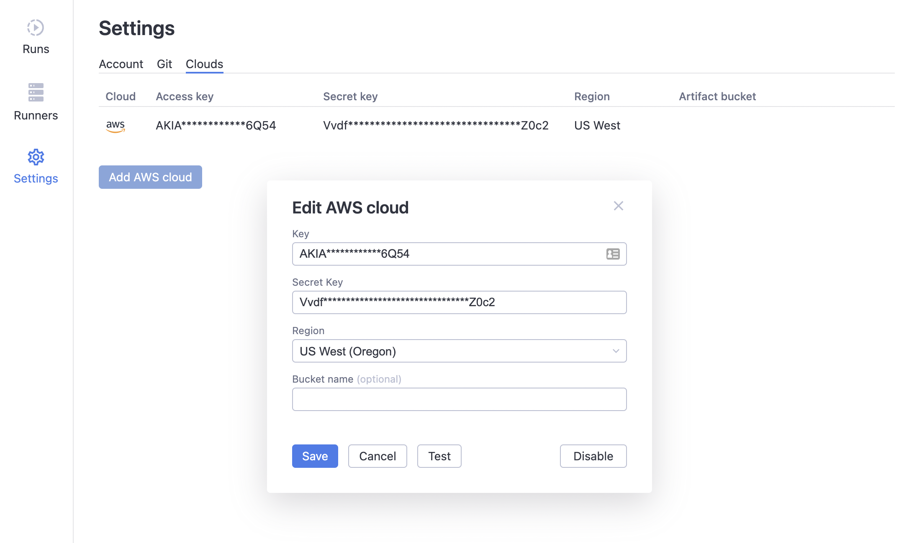

# What is dstack?

dstack is a workflow as code tool for AI researchers 👩🏽‍🔬 to define their workflows and the infrastructure they need declaratively.
Once defined, these workflows can be run interactively 🧪 in a reproducible manner 🧬. 
Infrastructure is provisioned on-demand and torn down when it's not needed 💨.
You're free to use any frameworks, vendors, etc.

[//]: # (## Why dstack? { #markdown data-toc-label='Principles' })
## Principles

As an AI researcher 👩🏽‍🔬, you always want to focus on experiments 🧪 and their metrics 📈. 

!!! warning ""
    Training production-ready models 👷🏽‍ however requires high reproducibility 🧬 and involves many things that may 
    distract you from your work.

### 📦 Versioning data

The data produced by your workflows should be saved automatically in an immutable storage 💿.

You should be able to chain workflows together ⛓ so one workflow may use the outputs of another workflow at any time.

### 🤖 Infrastructure as code

To ensure your workflows can be reproduced, you should be able to describe the 
infrastructure your workflows need declaratively as code 📝.

When you run your workflows, the infrastructure should be provisioned on-demand 🙏🏽 and torn down once it's not needed  
any more automatically 💨.

You should be able to use any type and vendor of the infrastructure.

### 🧪 Interactivity

While ensuring reproducibility, it should be possible to run workflows interactively from your IDE or Terminal.

### 🧩 Extensibility

You should be allowed to use any languages, libraries, frameworks, experiment trackers, or cloud vendors.

It should be possible to use multiple workflow providers, either created by yourself, or by the community 🌍.

!!! success ""
    With dstack, you get all of it in a simple and easy-to-use to use form 🙌.

[//]: # (## How does dstack work?)
[//]: # ()
[//]: # (![]&#40;images/dstack_how_it_works.png&#41;{: style="width:780px;max-width:100%;"})

## Quick tour

### 🧬 Workflows

#### Workflow syntax

Here's a basic example of a workflow that prepares some data:

=== ".dstack/workflows.yaml"

    ```yaml
    workflows:
      - name: prepare
        image: tensorflow/tensorflow:latest-gpu
        commands:
          - python3 prepare.py
        artifacts:
          - data
        resources:
          v100/gpu: $gpu
    ```

=== ".dstack/variables.yaml"

    ```yaml
    variables:
      prepare:
        gpu: 1
    ```

#### Command-line interface

You can run a workflow via the CLI:

```bash
dstack run prepare --gpu 4
```

dstack will provision the required infrastructure, and run the workflow. 

If you run `dstack status`, you'll see the following:

```bash
RUN            TAG     JOB           WORKFLOW    VARIABLES    SUBMITTED    RUNNER          STATUS
lazy-bobcat-1  <none>                prepare     --gpu 4      5 mins ago   quick-mule-1    DONE
                       711f6d690b4f  prepare     --gpu 4      5 mins ago   grumpy-duck-1   DONE
```

#### Run tags

Now, if the run was successful, you can mark the run with a tag.

```bash
dstack tag lazy-bobcat-1 latest
```
    
Now you can refer to this run from other workflows:

=== ".dstack/workflows.yaml"

    ```yaml
    workflows:
      - name: prepare
        image: tensorflow/tensorflow:latest-gpu
        commands:
          - python3 prepare.py
        artifacts:
          - data
        resources:
          v100/gpu: $gpu

      - name: train
        image: tensorflow/tensorflow:latest-gpu
        commands:
          - python3 train.py
        artifacts:
          - checkpoint
        dependencies:
          - prepare:latest
        resources:
          v100/gpu: $gpu     
    ```

=== ".dstack/variables.yaml"

    ```yaml
    variables:
      prepare:
        gpu: 1

      train:
        gpu: 1
    ```

When you run this workflow, the `data` folder produced by the `prepare:latest` will be mounted to it.

### 🤖 Runners

There are two ways to provision infrastructure: `On-demand` and `Self-hosted` runners.

#### On-demand runners

To use on-demand runners, go to the `Settings`, then `AWS`, provide your credentials, and configure limits:

{ lazy=true width="925" }

Once you configure these limits, runners will be set up and torn down automatically when there is a need.

#### Self-hosted runners

As an alternative to on-demand runners in your cloud account, you can use your own servers to run workflows.

To connect your server to your dstack account, you need to install the `dstack-runner` daemon there.