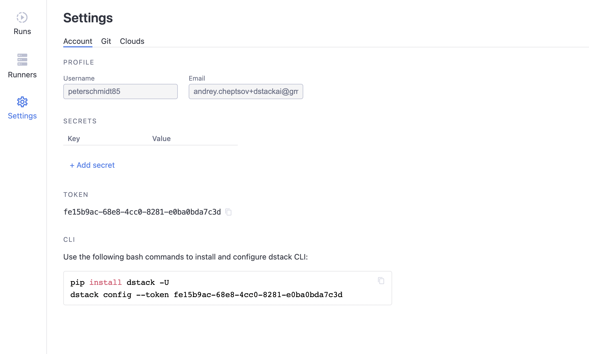
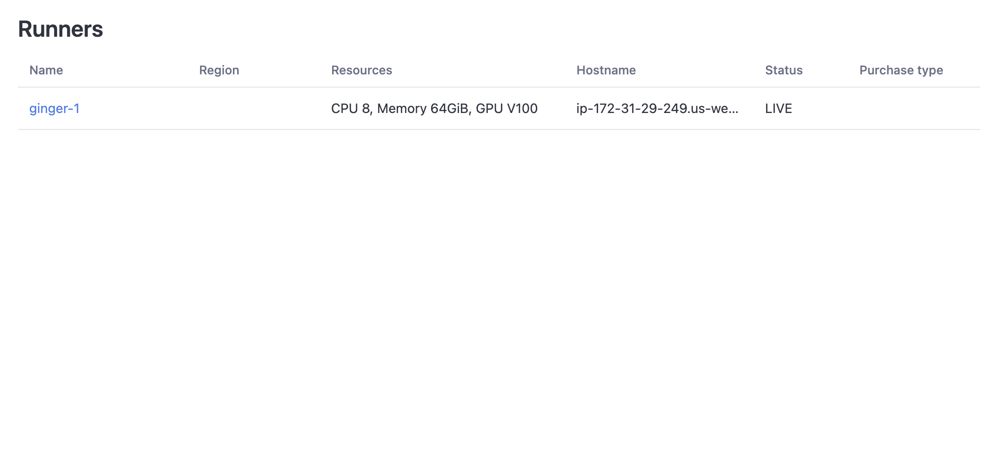
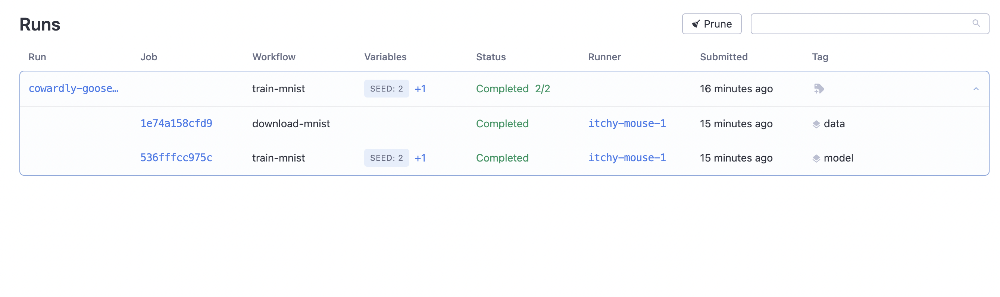

# Quickstart

## Introduction

dstack is a tool that lets you and others define AI workflows and run them on any infrastructure
in a reproducible manner.

This tutorial teaches you dstack essentials like workflows, runs, and runners. You'll set up 
runners, and run a basic workflow.

To complete this tutorial, you'll need a [dstack.ai](https://dstack.ai) account.

## Set up runners

Runners are machines that runs workflows (submitted by the user). dstack supports two types of runners: `On-demand
runners` and `Self-hosted runners`. 

`On-demand runners` are created automatically by dstack in the user's 
cloud account when there is a need. `Self-hosted runners` are set up manually by the user.

### Option 1: Set up on-demand runners

To use `On-demand runners`, go to the `Settings`, then `AWS`.

Here, you have to provide `AWS Access Key ID` and `AWS Secret Access Key` that have the
[corresponding](on-demand-runners.md#aws-credentials) permissions to create EC2 instances in you AWS account.

Once you provided credentials, use the `Add limit` button to configure limits.

{ lazy=true width="1060" }

### Option 2: Set up self-hosted runners

As an alternative to `On-demand runners`, you can register your own servers with dstack as `Self-hosted runners`.

In order to register your server with dstack, you have to run the following command on the server:

```bash
curl -fsSL https://get.dstack.ai/runner -o get-dstack-runner.sh
sudo sh get-dstack-runner.sh
dstack-runner config --token <token>
dstack-runner start
```

!!! info ""
    The `token` value can be found in `Settings`:

{ lazy=true width="1060" }

If you've done this step properly, you'll see your server in `Runners`.

{ lazy=true width="1060" }

## Install the CLI

Now, to be able to run and manage workflows interactively, install the dstack CLI.

```bash
pip install dstack -U
dstack config --token <token> 
```

## Clone the repository

In this tutorial, we'll run workflows defined in 
[`github.com/dstackai/dstack-examples`](https://github.com/dstackai/dstack-examples).

```bash
git clone https://github.com/dstackai/dstack-examples.git
cd dstack-examples
```

This project includes two workflows: `download-mnist` and `train-mnist`. The frst workflow downloads the [MNIST](http://yann.lecun.com/exdb/mnist/) dataset,
whilst the second workflow trains a model using the output of the first workflow as an input:

=== ".dstack/workflows.yaml"

    ```yaml
    workflows:
      - name: download-mnist
        image: python:3.9
        commands:
          - pip install -r requirements.txt
          - python3 download.py
        artifacts:
          - data
    
      - name: train-mnist
        image: pytorch/pytorch:1.10.0-cuda11.3-cudnn8-runtime
        commands:
          - pip install -r requirements.txt
          - python3 train.py $variables_as_args
        artifacts:
          - model
        depends-on:
          - download-mnist
        resources:
          gpu: 1     
    ```

=== ".dstack/variables.yaml"

    ```yaml
    variables:
     train-mnist:
       batch-size: 64
       test-batch-size: 1000
       epochs: 1
       lr: 1.0
       gamma: 0.7
       seed: 1
       log-interval: 10
    ```

## Run workflows

Go ahead, and run the `train-mnist` workflow using the following command:

```bash
dstack run train-mnist
```

If you want to change any of the variables, you can do that in `.dstack/variables.yaml`, or from the CLI:

```bash
dstack run train-mnist --epoch 14 --seed 2
```

When you run `train-mnist`, it will create a run with two jobs: one for `train-mnist` and one for `download-mnist` 
because `train-mnist` depends on `download-mnist`:

{ lazy=true width="1060" }

## Tag runs

Once the run is finished, you can mark it with a tag. You can add a tag either via the user interface of via the command line.

```bash
dstack tag cowardly-goose-1 latest
```

Now, you can refer to this run in `.dstack/workflows.yaml`:

```yaml
   workflows:
     - name: download-mnist
       image: python:3.9
       commands:
         - pip install -r requirements.txt
         - python3 download.py
       artifacts:
         - data

     - name: train-mnist
       image: pytorch/pytorch:1.10.0-cuda11.3-cudnn8-runtime
       commands:
         - pip install -r requirements.txt
         - python3 train.py $variables_as_args
       artifacts:
         - model
       depends-on:
         - download-mnist:latest
       resources:
         gpu: 1     
```

In this case, dstack will not trigger the `download-mnist` workflow and instead will use the artifacts of the tagged run.

!!! info "What's next"

    Now, if you haven't yet, it's time to give a try to dstack yourself. Go ahead, configure runners,
    and submit your first workflow. 

    Have questions or need support? Contact us in a [chat](javascript:$crisp.push(['do', 'chat:show']\);$crisp.push(['do', 'chat:open']\);), 
    or join our [Slack channel](https://join.slack.com/t/dstackai/shared_invite/zt-xdnsytie-D4qU9BvJP8vkbkHXdi6clQ).