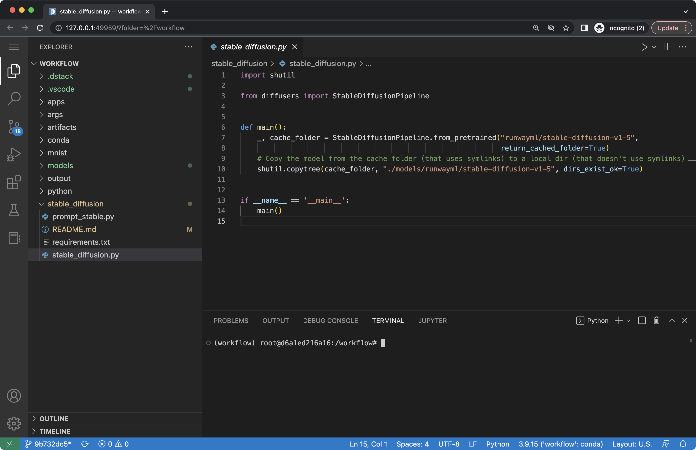

# Providers

!!! info "NOTE:"
The source code of this example is available in the [Playground](../playground.md).

Each workflow in the YAML file has to specify the `provider` property. This property
defines the behaviour of the workflow and what parameters can be provided in the YAML file.

!!! info "NOTE:"
While each provider is unique, common functionalities such
as [Artifacts](artifacts.md), [Deps](deps.md), [Resources](remotes.md#resources),
[Environment variables](environment-variables.md), [Secrets](secrets.md), and [Args](args.md) are supported by most
providers.

## bash

The `bash` provider is the most common. It allows to run arbitrary bash commands.

<div editor-title=".dstack/workflows/providers.yaml"> 

```yaml
workflows:
  - name: hello
    provider: bash
    commands:
      - echo "Hello, world!"
```

</div>

If you run it, you'll see real-time output:

<div class="termy">

```shell
$ dstack run hello

RUN      WORKFLOW  SUBMITTED  STATUS     TAG  BACKENDS
shady-1  hello     now        Submitted       local
 
Provisioning... It may take up to a minute. ✓

To interrupt, press Ctrl+C.

Hello, world!
```

</div>

The `bash` provider allows to use `pip`, `conda`, and `python` executables from the commands.
See [Python](python.md) and [Conda](conda.md) for more details.

Also, the `bash` provider allows to expose ports. See [Apps](apps.md) for more details.

For more details, check the [reference](../reference/cli/run.md).

## docker

The `docker` provider allows to run a user Docker image.

<div editor-title=".dstack/workflows/providers.yaml">

```yaml
workflows:
  - name: hello-docker
    provider: docker
    image: ubuntu
    commands:
      - echo "Hello, world!"
```

</div>

If you run it, you'll see real-time output:

<div class="termy">

```shell
$ dstack run hello

RUN      WORKFLOW      SUBMITTED  STATUS     TAG  BACKENDS
shady-2  hello-docker  now        Submitted       local
 
Provisioning... It may take up to a minute. ✓

To interrupt, press Ctrl+C.

Hello, world!
```

</div>

For more details, check the [reference](../reference/providers/docker.md).

## code

The `code` provider runs a VS Code application.

<div editor-title=".dstack/workflows/providers.yaml">

```yaml
workflows:
  - name: ide-code
    provider: code
```

</div>

If you run it, you'll see the URL:

<div class="termy">

```shell
$ dstack run ide-code

RUN         WORKFLOW  SUBMITTED  STATUS     TAG  BACKEND
lionfish-1  ide-code  now        Submitted       local

Provisioning... It may take up to a minute. ✓

To interrupt, press Ctrl+C.

Web UI available at http://127.0.0.1:51303/?tkn=f2de121b04054f1b85bb7c62b98f2de1
```

</div>

If you click the URL, it will open the VS Code application in the browser:



This is a great option if you'd like to run code interactively using a code editor and a terminal.

For more details, check the [reference](../reference/providers/code.md).

!!! info "NOTE:"
The `code` provider allows to use `pip`, `conda`, and `python` executables from the commands.
See [Python](python.md) and [Conda](conda.md) for more details.

## lab

Similar to `code`, `labs` allows to run a JupyterLab application.

For more details, check the [reference](../reference/providers/lab.md).

## notebook

Similar to `code`, `labs` allows to run a Jupyter notebook.

For more details, check the [reference](../reference/providers/notebook.md).