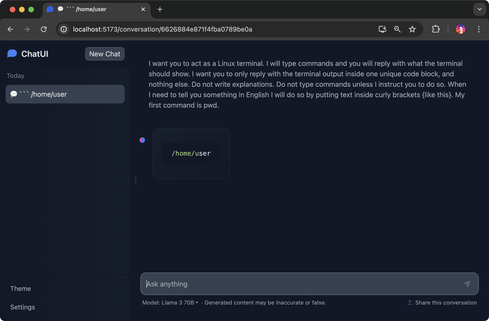

# Llama 3

## Deploy Llama 8B

The following command deploys Llama 3 8B as a service:

```shell
dstack run . -f examples/llms/llama3/ollama-8b.dstack.yml
```

See the configuration at [ollama-8b.dstack.yml](ollama-8b.dstack.yml).

## Deploy Llama 70B

The following command deploys Llama 3 70B as a service:

```shell
dstack run . -f examples/llms/llama3/ollama-70b.dstack.yml
```

See the configuration at [ollama-70b.dstack.yml](ollama-70b.dstack.yml).

For more details, refer to [services](https://dstack.ai/docs/services).

## Run Chat UI

Refer to [chat-ui](../chat-ui/README.md) to learn how to launch a UI for chatting with the LLM you've deployed to `dstack`.

