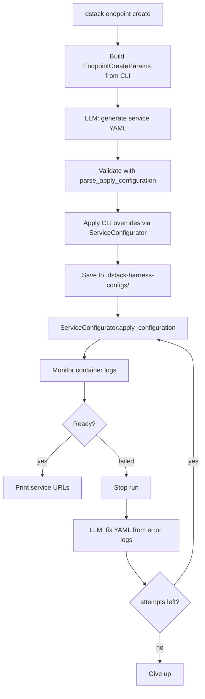

# Endpoint harness

The endpoint harness powers `dstack endpoint create`.
It uses an LLM to generate a [`type: service`](../concepts/services.md) configuration,
then deploys it through the same code path as [`dstack apply`](../reference/cli/dstack/apply.md).

You describe what to deploy (model, GPU, backends, and other profile options). The harness:

1. Asks an LLM to produce a service YAML (including container `commands`)
2. Validates and saves the configuration
3. Submits the run via dstack
4. Monitors logs and, on failure, may ask the LLM to fix the config and redeploy

The harness does **not** pick cloud offers or provision instances. dstack's scheduler
does that after submission, the same way it does for a hand-written service config.


## Quick start

<div class="termy">

```shell
$ export DSTACK_HARNESS_API_KEY=sk-ant-...
$ export DSTACK_HARNESS_MODEL=claude-sonnet-4-8
$ dstack endpoint create \
    --model meta-llama/Llama-3.1-8B-Instruct \
    --gpu 24GB \
    --max-attempts 3 \
    -y
```

</div>

`DSTACK_HARNESS_MODEL` is optional. If unset, the harness defaults to `claude-sonnet-4-6`
for Anthropic.

!!! note "`--max-attempts`"
    Controls how many times the harness tries to deploy the endpoint. If the container
    fails to start, it stops the run, asks the LLM to fix the configuration from the
    error logs, and redeploys. Default is `3`. Set `--max-attempts 1` for a single
    attempt with no retries.

The command accepts the same resource and profile flags as [`dstack apply`](../reference/cli/dstack/apply.md)
for services (`--gpu`, `--cpu`, `--memory`, `--disk`, `--backend`, `--region`, `--fleet`,
`--max-price`, `--spot-policy`, and others). Run `dstack endpoint create --help` for the full list.

## How it works



Orchestration is **programmatic** (Python via `ServiceConfigurator`), not LLM-generated
`dstack` shell commands. The LLM only authors the service configuration and container
`commands` that run on the GPU instance.


## Relationship to `skills/dstack/SKILL.md`

On every LLM call, the harness loads `skills/dstack/SKILL.md` and appends it to the system
prompt.

## Prompts Send to LLM

### Call 1: Generate configuration

Fixed prefix:

```
You generate dstack service configuration files for model inference endpoints.

Rules:
- Output a single valid YAML document for `type: service`
- Do not wrap the YAML in markdown unless you also include the YAML body in a fenced block
- Use only documented dstack service fields
- Put secret values only as env var names in `env`, never inline values
- Include `model`, `port`, `commands`, and `resources.gpu` when possible
- Prefer `python: "3.12"` unless the user requests a custom image
- User-provided CLI options in the request are mandatory: use the exact GPU, backends,
  regions, fleets, CPU, memory, disk, and other resource/profile values given
- Do not substitute different resource sizes or backends than those specified by the user
- Do not invent unsupported CLI flags or YAML properties

Reference skill:

<entire contents of skills/dstack/SKILL.md>
```


CLI options:

```
Generate a dstack service configuration for an inference endpoint.
The user passed these CLI options. You MUST use them exactly in the YAML. Do not substitute different GPU memory, backends, regions, fleets, or other resource/profile values.
{
  "model": "meta-llama/Llama-3.1-8B-Instruct",
  "name": "meta-llama-3-1-8b-instruct",
  "gpu": "24GB"
}

Return only the YAML configuration.
```


### Call 2: Fix configuration

Fixed prefix:

```
You fix dstack service configurations that failed to start on the GPU instance.

You are given the previous configuration and the container error logs. Return a
corrected single YAML document for `type: service`.

Rules:
- Change as little as possible to address the specific error in the logs
- Keep `model`, `name`, and `resources` unless the error requires changing them
- For vLLM KV-cache / out-of-memory errors, prefer adding serve flags such as
  `--max-model-len` or `--gpu-memory-utilization` rather than changing the GPU
- Keep secret values as env var names only, never inline values
- Use only documented dstack fields and valid serving CLI flags
- Do not invent unsupported CLI flags or YAML properties

Reference skill:

<entire contents of skills/dstack/SKILL.md>
```


Error logs:

````
The following dstack service configuration failed to start:
```yaml
type: service
name: meta-llama-3-1-8b-instruct
model: meta-llama/Llama-3.1-8B-Instruct
python: "3.12"
port: 8000
commands:
  - |
    pip install vllm
    vllm serve meta-llama/Llama-3.1-8B-Instruct \
      --host 0.0.0.0 \
      --port 8000
resources:
  gpu: 24GB:1
```

Container error logs (tail):
```
...
torch.cuda.OutOfMemoryError: CUDA out of memory. Tried to allocate ...
```

Return only the corrected YAML configuration.
````
